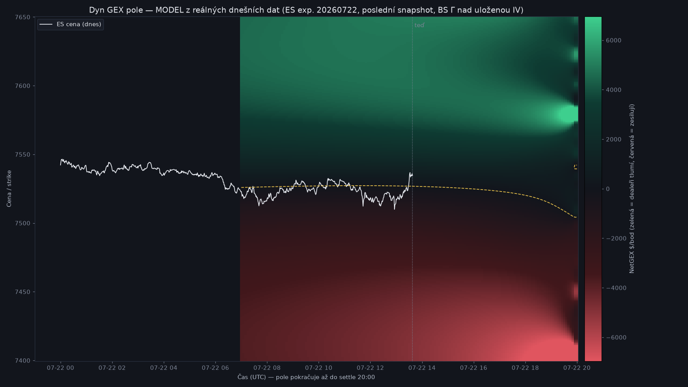

# GEXLens — Uživatelský manuál

*Verze 1.3 · červenec 2026 · pro aplikaci GEXLens v0.1*

GEXLens je aplikace pro intradenní tradery futures opcí (ES, NQ a další CME podklady). Vizualizuje **opční positioning** — kde sedí koncentrace open interestu a volume, kde je zero-gamma flip, kde jsou call/put walls a Max Pain — a jak se to všechno vyvíjí v čase. Jediným zdrojem dat je tvůj účet u **Interactive Brokers** (TWS/IB Gateway API); žádná data neodcházejí mimo tvůj počítač.

---

## Obsah

1. [Co aplikace umí](#1-co-aplikace-umí)
2. [Co potřebuješ před prvním spuštěním](#2-co-potřebuješ-před-prvním-spuštěním)
3. [Spuštění a vypnutí aplikace](#3-spuštění-a-vypnutí-aplikace)
4. [Hlavní obrazovka — Graf](#4-hlavní-obrazovka--graf)
5. [Heatmapa podrobně](#5-heatmapa-podrobně)
6. [Cenová vrstva — křivka a svíčky](#6-cenová-vrstva--křivka-a-svíčky)
7. [Strike profil (pravý panel)](#7-strike-profil-pravý-panel)
8. [Spodní panely — Vol, Opt Vol, Cum Δ](#8-spodní-panely--vol-opt-vol-cum-δ)
9. [Playback — přehrávání dne](#9-playback--přehrávání-dne)
10. [Anotace — kreslení do grafu](#10-anotace--kreslení-do-grafu)
11. [Dashboard](#11-dashboard)
12. [IBKR Console](#12-ibkr-console)
13. [Settings](#13-settings)
14. [Notifikace a alerty](#14-notifikace-a-alerty)
15. [Stavová lišta — co znamenají údaje](#15-stavová-lišta--co-znamenají-údaje)
16. [Deep-linky](#16-deep-linky)
17. [Řešení potíží](#17-řešení-potíží)
18. [Obchodní čtení — režimy trhu, Dyn GEX a flip](#18-obchodní-čtení--režimy-trhu-dyn-gex-a-flip)
19. [Slovníček pojmů](#19-slovníček-pojmů)

---

## 1. Co aplikace umí

- **Heatmapa čas × strike** — barevná mapa opčního positioningu přes celý obchodní den. Zelená (teal) = call strana, červená = put strana. Sedm přepínatelných metrik (**Mode**: OI, Vol OTM/ITM, Vol ±, OI+OTM, OI−ITM, OI±All) a čtyři škály (**Scale**: Linear, √, Log, Pow⅓).
- **GEX úrovně** — automaticky počítaný **flip** (zero-gamma), **call wall**, **put wall**, **centroid** a **Max Pain**, vykreslované jako časové linie i horizontální úrovně s cenovkami, přepočítávané každou minutu. Volitelné **Walls** módy (Peak/Center/Smooth/Flip/Ridge).
- **Multi-instrument** — watchlist v sidebaru: přidej ticker (ES, NQ, RTY…) a engine ho začne sbírat **do několika sekund**; svíčky a Vol panel se zpětně doplní za celý den, opční data (OI, Greeks) běží od momentu přidání. Kliknutím přepínáš celou aplikaci.
- **Více expirací najednou** — vedle aktivního řetězu se sbírá i následující expirace (čtení positioningu příští seance) a pravý profil umí **Σ souhrn přes expirace**.
- **Živý tok** — kumulativní delta flow (Cum Δ) s klasifikací agresora + **Δ Flow C/P** (tok zvlášť za call/put stranu).
- **ΔOI vs. včera** — kde přes noc přibyly/ubyly otevřené pozice (tooltip profilu).
- **Replay** — skrytý za tlačítkem ⏮ Replay; slider přehraje vývoj dne rychlostí 1×/5×/20×. Aplikace defaultně jede vždy live.
- **Anotace** — šipky, linie a kreslení od ruky přímo do grafu; uložené k instrumentu a dni, přežijí restart.
- **Dashboard, IBKR Console, Settings** — provozní obrazovky pro přehled, diagnostiku a konfiguraci.


---

## 2. Co potřebuješ před prvním spuštěním

Kompletní checklist je v GitHub issue [#1 — Setup uživatelského prostředí](https://github.com/kEchiCZ/GEX/issues/1). Stručně:

1. **Účet u Interactive Brokers** s aktivní market data subskripcí **CME Real-Time – North America** (levná L1 varianta za ~1.55 USD/měs. stačí — ověřeno).
2. **TWS nebo IB Gateway** nainstalované, přihlášené a se zapnutým API:
   - *Edit → Global Configuration → API → Settings* → ✅ **Enable ActiveX and Socket Clients**
   - Socket port **7496** (live) / **7497** (paper)
   - Do *Trusted IPs* přidej `127.0.0.1`
   - *Read-Only API* nech zapnuté — GEXLens nikdy neobchoduje, jen čte data
3. **Docker Desktop** (na Windows s WSL2 backendem).

> ⚠️ **Jedno přihlášení na username:** když se stejným IBKR loginem přihlásíš jinde (mobil, druhé PC), TWS na tomto počítači spadne a aplikace ztratí data. Po návratu se stačí v TWS znovu přihlásit — aplikace se připojí sama.

---

## 3. Spuštění a vypnutí aplikace

### Ikonou na ploše (doporučeno)

Poklepej na ikonu **GEXLens** na ploše. Skript spustí všechny služby na pozadí a otevře prohlížeč na adrese aplikace. První start po vypnutí počítače trvá ~30–60 s.

### Ručně (PowerShell)

```powershell
cd "D:\Documents\Visual Studio Code\GEX"
docker compose up -d        # start na pozadí
# prohlížeč: http://127.0.0.1:8080
```

### Vypnutí

```powershell
docker compose stop         # zastaví služby (data zůstávají)
```

Aplikaci můžeš nechat běžet trvale — engine sbírá data, jen když běží a je přihlášené TWS; mimo seance prostě čeká.

### Pořadí při startu dne

1. Zapni/přihlas **TWS** (nebo IB Gateway)
2. Spusť **GEXLens** (pokud neběží)
3. Do minuty se ve stavové liště objeví `IBKR: connected` a začnou přibývat data

---

## 4. Hlavní obrazovka — Graf

Obrazovka se skládá z (shora dolů, zleva doprava):

| Prvek | Popis |
|---|---|
| **Sidebar (vlevo)** | Přepínání obrazovek (Graf / Dashboard / Řetěz / Setupy / IBKR Console / Settings), přepínač tématu Dark/Light, **editovatelný watchlist** (kliknutí na ticker přepne instrument, × odebere, políčko dole přidá nový), verze. Tlačítkem « se sbalí. |
| **Hlavička** | Ticker a název instrumentu, **poslední cena + denní změna v %**, **selektor expirace** s typem (denní/týdenní/měsíční/kvartální/EOM) a odpočtem „expiruje ≈ za X h" — velké expirace nesou velké OI. V selektoru najdeš i **následující expiraci** (sbírá se souběžně — čtení positioningu příští seance). Indikátor ● Live / ○ Offline, zvonek notifikací. |
| **Řádek timeframe** | **Intraday/Daily** a rozlišení **1m, 2m, 3m, 5m, 10m, 15m, 30m, 45m, 1h, 2h, 3h, 4h, 1d**. Intraday agreguje minutová data do zvolených košů (svíčky OHLC, objemy se sčítají); Daily zobrazí sloupec za každý uložený den (roste s historií, max 14 dní). |
| **Řádek přepínačů** | Checkboxy vrstev: **Dyn GEX** (modelované pole jako podklad heatmapy — kombinuje se s libovolným módem, kap. 18), **Zdi** (call/put wall linie), **GEX Levels**, **GEX žebřík** (top významné striky jako barevné úrovně: zelené call nad cenou, červené put pod ní, s podílem na síle strany v cenovce — Kooperovo čtení „parametrů"; jen striky s dostatečnou dominancí) (flip/centroid/Max Pain), **Sessions** (automatické markery světových seancí), **Vol / Opt Vol / Delta / Δ Flow C/P** (spodní panely), **Vol + OI Δ**, **Projekce**, **News**. Co odškrtneš, zmizí — layout se přeskládá. |
| **Lišta grafu** | **Mode** (7 metrik heatmapy), **Scale** (Linear/√/Log/Pow⅓), **Walls** (Off/Peak/Center/Smooth/Flip/Ridge), Styl (Gradient/Blobs), Contours (Off/Major/All), **Cena** (Svíčky/Křivka) + **Viditelnost**, nástroje anotací + barva, indikátor zdroje dat, tlačítko **⏮ Replay**. |
| **Heatmapa** | Hlavní plocha — viz kapitola 5. |
| **Strike profil** | Pravý panel; **předěl mezi grafem a panelem jde táhnout** (kurzor ↔) — viz kapitola 7. |
| **Spodní panely** | Vol / Opt Vol / Δ Flow / Cum Δ — viz kapitola 8. |
| **Playback lišta** | Defaultně skrytá (aplikace jede vždy live) — zobrazí ji tlačítko **⏮ Replay**; viz kapitola 9. |
| **Stavová lišta** | Zdraví datové pipeline — viz kapitola 15. |

---

## 5. Heatmapa podrobně

Heatmapa zobrazuje matici **čas (osa X) × strike (osa Y)**. Každá buňka je jedna minuta jednoho striku; intenzita barvy odpovídá hodnotě zvolené metriky. **Teal/zelená = call strana, červená = put strana.**

### Ovládání myší (styl TradingView)

| Akce | Efekt |
|---|---|
| Kolečko nad plochou | Zoom obou os **ukotvený ke kurzoru** (bod pod myší zůstává na místě) |
| Kolečko nad pruhem osy | Zoom **jen dané osy** (levý okraj = osa strikes, spodní okraj = osa času) |
| Tažení za pruh osy Y (levý okraj) | Roztahování/stahování cenové osy — zvětší/zmenší svíčky svisle |
| Tažení / kolečko na **pravém panelu** (profil) | **Ovládá stejnou cenovou osu Y** jako levý okraj — táhni svisle nebo kolečkuj přímo nad profilem (kurzor ↕) |
| Tažení za pruh osy X (spodní okraj) | Roztahování/stahování časové osy — zvětší/zmenší svíčky vodorovně (kotva u pravého okraje: poslední svíčka drží pozici) |
| Tažení v ploše | Posun (pan) |
| **Dvojklik** nebo tlačítko **⟲** (pravý horní roh) | **Reset zobrazení** na výchozí pohled |
| Pohyb myší | Crosshair — svislá linka snapnutá na svíčku, vodorovná sleduje kurzor; synchronizovaný se strike profilem i spodními panely + tooltip buňky (minuta, strike, hodnoty call/put) |

Crosshair navíc ukazuje **osové štítky jako TradingView**: dole na ose X **datum + čas** pod svislou linkou, vpravo na ose Y **cenu** na úrovni kurzoru. Cena je zaokrouhlená na **minimální tick instrumentu** (ES/NQ = 0,25) — mezi 7530,00 a 7530,25 tedy nic není. Crosshair **zůstává viditelný i mimo svíce** — když posuneš graf a jedeš myší přes prázdnou/budoucí plochu, nezmizí.

**Pohled se nesmýká sám.** Graf se automaticky napasuje (fit na cenové pásmo + ukotvení historie) **jen při změně datasetu** — jiný symbol, expirace, timeframe nebo den. Resize pravého panelu, živý přírůstek minut ani úprava os **tvůj pan/zoom nepřepíšou**. Kdykoli se vrátíš na napasovaný pohled dvojklikem nebo tlačítkem ⟲.

Spodní panely (Vol / Opt Vol / Cum Δ) **sledují časovou osu heatmapy** — při posunu či zoomu osy X se roztahují synchronně.

### Mode — osm metrik heatmapy

Select **Mode** přepíná, co buňky zobrazují (přepočet je okamžitý, bez čekání na server; dostupné nad živými/replay daty):

| Mode | Co ukazuje |
|---|---|
| **OI** | Open interest per strike (výchozí). Dokud ranní OI nedorazí, automaticky se použije volume. |
| **Vol OTM** | Volume jen OTM opcí (call nad spotem, put pod spotem) — čerstvá spekulace/zajištění |
| **Vol ITM** | Volume ITM opcí |
| **Vol ±** | Rozdíl call − put volume (zeleno-červená divergenční mapa) |
| **OI+OTM** | Vážená kombinace OI (60 %) a OTM volume (40 %) — „kde sedí i kde se dnes hraje" |
| **OI−ITM** | OI očištěné o ITM volume |
| **OI±All** | Rozdíl call − put OI (divergenční) |
| **VEX** | Vega Exposure = vega × OI per strana — kolik $ přecenění drží dealeři na striku při změně IV o 1 bod. Strikes s velkou VEX = „volatility walls": při skoku IV (zprávy, FOMC) se tam nejvíc přehedgovává. Před událostmi relevantnější než OI mapa. |
| **VEX ±** | Rozdíl call − put VEX (divergenční zobrazení vega rizika) |


Select **Scale** mění škálu hodnot: **Linear**, **√** (zvýrazní slabší), **Log**, **Pow⅓**. Znaménko se zachovává.

### Walls — detekce zdí

Select **Walls** kreslí bílé čárkované linie počítané z právě zobrazené vrstvy:

- **Peak** — strike s maximem metriky per minuta (call i put strana)
- **Center** — vážené těžiště per minuta
- **Smooth** — vyhlazený Peak (EMA 15 minut)
- **Flip** — kopie zero-gamma řady
- **Ridge** — souběžné hřebeny koncentrací (víc zdí najednou, s filtrem šumu)

### Styl vykreslení

- **Gradient** — hladké bilineární přechody (výchozí)
- **Blobs** — gaussovské „bubliny“ kolem koncentrací; zvýrazní ohniska positioningu

### Contours (izolinie)

Bílé přerušované vrstevnice nad vyhlazeným polem:
- **Off** — vypnuto
- **Major** — dvě úrovně (p75 a p90) — jen hlavní koncentrace
- **All** — pět úrovní — detailní tvar

### Linie v heatmapě (overlaye)

| Linie | Barva | Zapíná |
|---|---|---|
| **Flip (zero-gamma)** | žlutá | GEX Levels |
| **Centroid (HVL)** | fialová | GEX Levels |
| **Max Pain** | magenta | GEX Levels (počítá se z OI) |
| **Call wall** | zelená | Zdi |
| **Put wall** | červená | Zdi |
| **Walls módy** | bílé čárkované | select Walls |
| **Sessions markery** | šedé svislé (Tokio, Londýn, US Open…) | Sessions |
| **Cenová vrstva** | zelená/červená | vždy (viz kap. 6) |

Každá úroveň se navíc promítá jako **horizontální čárkovaná linka přes celou šířku s barevnou cenovkou** u levého okraje (poslední známá hodnota) — na první pohled vidíš, kde úrovně právě leží. Vpravo na ose je **štítek aktuální ceny**; v pravém dolním rohu **timestamp** posledních dat.

### Stale buňky

Pokud se některý strike nepodařilo obnovit (výpadek dat), jeho buňky jsou **vyšedlé s nižší sytostí** — poznáš tak stará data od živých. Souhrn běží ve stavové liště (`Repair: retrying N…`).

---

## 6. Cenová vrstva — křivka a svíčky

V liště grafu volbou **Cena**:

- **Svíčky** (výchozí) — plnohodnotné OHLC svíčky (knot high–low, tělo open–close) v rozlišení zvoleného timeframe.
- **Křivka** — spojitá linie zbarvená podle směru ticku (zelená nahoru, červená dolů).

Graf se při načtení **automaticky napasuje na cenové pásmo dne** (svíčky vyplní výšku); okolní zóny heatmapy dosáhneš tažením/kolečkem za osu Y, reset vrací napasovaný pohled. Po startu s **málem dat** (ráno) mají svíčky **fixní šířku** ukotvenou k pravému okraji — neroztahují se přes celý graf jako dřív.

Posuvníkem **Viditelnost** (10–100 %) cenovou vrstvu zeslabíš, aby nepřebíjela heatmapu pod ní — užitečné hlavně u svíček. **Štítek aktuální ceny zůstává vždy plně viditelný.**


---

## 7. Strike profil (pravý panel)

Horizontální skládané pruhy pro každý strike, **na stejné výškové ose jako heatmapa** — strike v profilu je vždy na stejné úrovni obrazovky jako v grafu a při zoomu/posunu osy Y se hýbou synchronně:

- **Call doprava (teal), put doleva (červená)** od symetrické osy; popisky **Put/Call** nahoře
- Každý pruh má dvě složky odlišené sytostí: **Vol** (sytá) a **OI Δ** (světlejší)
- U konce pruhů jsou **číselné hodnoty** (Δ-vážené kontrakty) — na každém k-tém řádku, ať se nepřekrývají. Pruhy končí kousek před okrajem, takže nepřetékají mimo panel.
- Dole **osa množství** (Δ-vážené kontrakty, formát „5k") — vidíš, jak velké zdi reálně jsou; měřítko reaguje na zoom
- **Šedá přerušovaná linka** = aktuální cena (spot)
- Tlačítko **GEX** = křivka modelovaného **Dyn GEX profilu** (zelená doprava = dealeři tlumí, červená doleva = zesilují); **žlutá přerušovaná linka** = **dynamický flip** (průchod křivky nulou). Detaily čtení: kapitola 18.
- Pod hlavičkou panelu běží readout **Vol leadeři** — top 3 strany (strike × C/P) podle opčního volume vybrané expirace, např. „7450P 4,1k · 7500P 2,9k". Sleduje playback i Σ souhrn; na zítřejší expiraci před eventem ukazuje, kde se trh zajišťuje (viz alert Vol koncentrace).
- Tlačítko **Rel / Abs** přepíná měřítko: **Rel** = normalizace na největší pruh ve výřezu (výchozí), **Abs** = zaokrouhlený „hezký" strop (kulaté hodnoty na ose, stabilnější délky pruhů mezi snímky)
- Tlačítka **1× / 2× / 4×** zvětšují měřítko pruhů
- Tlačítko **Σ** = souhrn přes všechny sbírané expirace tohoto instrumentu (pondělní + úterní řetěz…). Hlavička se změní na „Σ expirací"; heatmapa zůstává u zvolené expirace. Celkový positioning bez přepínání.
- Najetí myší na řádek zvýrazní strike v celé aplikaci (crosshair) a dole zobrazí **tooltip**: OI call/put, Vol call/put, **ΔOI vs. včera C/P** (kde přes noc přibyly/ubyly pozice; jen per expirace, v Σ režimu se neukazuje), vzdálenost od spotu
- **Šířku panelu změníš tažením předělu** mezi grafem a panelem (kurzor ↔). Panel jde roztáhnout hodně doleva (až ~360 px zbyde na graf), aby byla vidět celá délka pruhu i s číslem.
- **Profilem ovládáš i cenovou osu Y grafu** — tažení svisle nebo kolečko nad profilem stlačuje/roztahuje ceny stejně jako levý okraj heatmapy (kurzor ↕).

Čteš z něj na první pohled, **kde sedí dominantní call a put koncentrace** — typicky walls.

> **Proč večer „zmizí" jedna strana pruhů?** Pruhy jsou **Δ-vážené** — násobí se deltou opce (kolik futures dealer na kontrakt reálně drží). Ke konci seance se delta polarizuje (viz gamma crunch, kap. 18): OTM opce mají deltu skoro 0, ITM skoro 1. Nad spotem proto zbývají hlavně červené (ITM puty) a pod spotem zelené (ITM cally). Není to chyba — surové OI/Vol obou stran pořád vidíš v tooltipu řádku; zapnutím **Σ** se přimíchá zítřejší expirace s měkčími deltami a obě strany se zase objeví.

---

## 8. Spodní panely — Vol, Opt Vol, Cum Δ

Tři panely se **sdílenou časovou osou** s heatmapou. Každý zvlášť vypneš checkboxem v horní liště (Vol / Opt Vol / Delta).

| Panel | Co ukazuje |
|---|---|
| **Vol** | Minutový objem podkladu (futures) — šedé sloupce |
| **Opt Vol** | Minutový objem opcí, **barevně call (teal) / put (červená)** vedle sebe |
| **Δ Flow C/P** | Delta-vážený opční tok zvlášť za call a put stranu (\|Δ\| × přírůstek volume). Z něj čteš, **na které straně se právě obchoduje** — např. „uzavírání callů" = call sloupce slábnou. Default vypnutý (checkbox Δ Flow C/P). |
| **Cum Δ** | Kumulativní delta flow jako plocha **nad nulou (zelená) / pod nulou (červená)**. Roste = agresivní kupci call delty / prodejci put delty; klesá = opačně. Počítá se s plnou klasifikací agresora (tick-by-tick v hot zóně, midpoint test jinde) a resetuje se na začátku dne. |

Pohyb myší v kterémkoli panelu hýbe crosshairem ve všech panelech i heatmapě. Při najetí navíc uvidíš **hodnoty ukazatele**:

- **vpravo nahoře** hodnotu pro **minutu pod crosshairem** (Opt Vol a Δ Flow zvlášť C/P);
- **vpravo na ose Y** hodnotu podle **výškové úrovně kurzoru** (ne max daného času) + **vodorovnou crosshair linku** na té úrovni. U Cum Δ je škála znaménková kolem nuly.

---

## 9. Playback — přehrávání dne

**Aplikace defaultně jede vždy live** — replay lišta je skrytá, aby nerušila. Zobrazíš ji tlačítkem **⏮ Replay** v liště grafu:

- **Slider** — táhni kamkoli v dni; heatmapa, strike profil i spodní panely se **synchronně přetočí** k danému okamžiku
- **▶ / ⏸** — automatické přehrávání; rychlosti **1× / 5× / 20×** (1× = 2 minuty dne za sekundu)
- **● Live** — skok zpět na aktuální okamžik; přehrávání na konci dne se zastaví samo
- **Zavření lišty** (druhý klik na ⏮ Replay) graf automaticky vrátí na live

Celý den je po načtení v paměti — přetáčení je okamžité, bez čekání na server. Při přepnutí timeframe zůstává live pozice live a rozehraný replay se přemapuje proporcionálně.

---

## 10. Anotace — kreslení do grafu

V liště grafu vyber nástroj:

| Nástroj | Použití |
|---|---|
| **Kurzor** | Běžný režim (pan/zoom/crosshair) |
| **Šipka** | Táhni od–do; šipka s hlavičkou |
| **Linie** | Táhni od–do; rovná čára |
| **Freehand** | Kresli od ruky |
| **Guma** | Klikni poblíž anotace — smaže ji |

Vedle nástrojů je **výběr barvy**. Anotace jsou ukotvené k **času a striku** (ne k pixelům) — drží na svém místě při zoomu, panu i přetáčení, **přežijí restart aplikace** a jsou uložené zvlášť pro každý instrument a den.

---

## 11. Dashboard

Karty instrumentů z watchlistu: aktuální cena, stav dat (● live / offline), **GEX režim badge**, **PCR sentiment** (Put/Call ratio z vlastních dat: vol = dnešní tok, OI = držené pozicování, mini křivka = vývoj PCR vol za den s referencí 1.0; extrémy kontrariánsky), **mini NetGEX profil** (zelené/červené sloupečky = čistý positioning po stricích) a vzdálenosti k call/put wall. Slouží jako rychlý přehled, když sleduješ víc instrumentů.


---

## 11b. Řetěz — Greeks & OI tabulka

Obrazovka **Řetěz** v sidebaru ukazuje klasickou opční tabulku vybrané expirace: **call strana vlevo, strike uprostřed, put vpravo**, sloupce Bid/Ask/Last/Vol/IV/Δ/Γ/Θ/Vega/OI/ΔOI (put strana zrcadlově, ať OI sousedí se strikem). Data jsou **živý pohled z poslední minuty** sběru, obnovují se každou minutu; ΔOI porovnává s posledním archivovaným dnem. Řádek nejblíž aktuální ceně je zvýrazněný (ATM), strany se zastaralými kotacemi jsou ztlumené. Expirace se přepíná selektorem v hlavičce — funguje i pro zítřejší řetěz.

---

## 12. IBKR Console

Diagnostická obrazovka:

- **Připojení** — host/port/client ID, tlačítko **Reconnect** (vyžádá znovupřipojení enginu), aktuální stav spojení
- **Subskripce** — průběh Greeks (X/Y), velikost repair fronty, vytížení market data lines
- **Log** — chronologický záznam událostí (změny stavu spojení, alerty)

Sem se podívej jako první, když něco nevypadá dobře.


---

## 13. Settings

Změny se **ukládají okamžitě** (bez tlačítka Uložit) a engine si je průběžně přebírá:

| Sekce | Položky |
|---|---|
| **IBKR** | Host, port (7496 live / 7497 paper), client ID |
| **Engine** | **Rozsah strikes (± body od spotu)** — engine si změnu přebere do 5 minut za běhu a rozšíří sbírané pásmo (max 400; vidět vzdálená křídla à la pojistky hluboko OTM), velikost dávky subskripcí, šířka hot zóny, retence dat (dny), disk limit (GB) |
| **Vzhled** | Téma **Dark/Light** (přepne se ihned), jazyk |
| **Seance** | Historické pole (JSON) — markery seancí se nově generují **automaticky** z časů světových burz; checkbox Sessions v grafu |


Light téma:


---

## 14. Notifikace a alerty

**Zvonek** v hlavičce ukazuje badge s počtem nepřečtených alertů; kliknutím otevřeš historii (otevření badge vynuluje). Alerty chodí i za běhu do IBKR Console logu.

Zvonek je **globální — sbírá alerty napříč všemi instrumenty** ve watchlistu, ne jen z toho na grafu. Proto je u každého alertu **datum + čas** notifikace a **symbol instrumentu** (např. `[NQ · setup]`). Naproti tomu **karty a linie setupů přímo v grafu jsou jen pro instrument, který máš zobrazený.**

Druhy alertů:

| Alert | Kdy |
|---|---|
| Cena × úroveň | Cena protne flip nebo wall |
| Cum Δ skok | Skok kumulativní delty o nastavený práh |
| Dominantní strike | Změna striku s největší koncentrací |
| Výpadek spojení | TWS/Gateway nedostupné |
| Disk limit | Překročen limit místa na disku |
| **OI nedorazilo** | IBKR nedodalo Open Interest — GEX vrstvy jedou dočasně z volume (viz Řešení potíží) |
| **Instrument nejde spustit** | Ticker z watchlistu není futures s opčním řetězem (např. akcie) — engine to zkusí znovu za 30 minut |
| Obálka na stropu | Pásmo strikes dosáhlo maxima šířky — vzdálený okraj se posouvá za cenou |
| **Svíčky se přestaly kreslit** | Real-time bary z TWS nechodí, ale cena žije (mrtvé TWS farmy po noční přestávce) — pomáhá restart TWS; díra se po návratu doplní sama |
| Svíčky zase jedou | Bary se vrátily — díra ve svíčkách se doplní backfillem |
| **Vol koncentrace** | Jedna strana (strike × C/P) příští expirace výrazně převyšuje zbytek (≥ 3× medián top 10) — úroveň, kde se trh zajišťuje na zítřek (put pod trhem pojistka/magnet, call nad trhem strop) |
| **Nový setup** | Detektor našel obchodní setup (odraz od zdi / neúspěšný průraz / Max Pain pin / gamma momentum / divergenční spring) |
| **FA validace** | Ranní kalibrační bod FA vrstvy: po příchodu OI archivu engine porovná včerejší klasifikovaný volume s ΔOI (open-ratio ≈ α, korelace) a bod uloží pro kalibraci — čistě informační |

### Setupy

Když detektor najde setup, přijde alert **Nový setup** a nad grafem se ukáže **karta setupu** pro daný instrument: směr (LONG/SHORT), šablona, **datum a čas vzniku** (kdy se splnily podmínky), úrovně **Entry / Cíl / Stop**, RRR a důvěra, plus krátké zdůvodnění. Stejné úrovně se kreslí jako linie přímo v heatmapě. Kartu skryješ křížkem (setup dál běží). Historii, úspěšnost a hodnocení 👍/👎 najdeš na obrazovce **Setupy** v sidebaru.

**Kontra-režimový filtr:** obchod proti gamma režimu (long v negativní gammě / short v pozitivní — „fade v červeném", nejčastější ztráta z kap. 18) má u odrazu od zdi a neúspěšného průrazu přísnější podmínky: musí ho potvrdit CumΔ přes delší okno (30 min), jinak setup nevznikne. A po kontra setupu uzavřeném na stop má stejná šablona 45min pauzu na další kontra pokus — brání sérii ztrát v trendovém dni. Potvrzené setupy poznáš v zdůvodnění podle „Kontra-režim potvrzen tokem".

---

## 15. Stavová lišta — co znamenají údaje

| Údaj | Význam | V pořádku |
|---|---|---|
| `Greeks X/Y` | Kolik kontraktů řetězce má kompletní data (bid/ask/volume/Greeks) | X = Y |
| `Repair: retrying N…` | Kontrakty čekající na opakované načtení | Nezobrazuje se, nebo malé N |
| `Lines NN %` | Vytížení market data lines účtu | < 100 % |
| `Disk X / Y` | Obsazení disku daty / limit | X < Y |
| `IBKR: connected :7496` | Stav spojení + port | connected |
| `● Live HH:MM` / `Stale` | Čas posledních dat | ● Live, čas se hýbe |

---

## 16. Deep-linky

Aplikaci lze otevřít rovnou v konkrétním stavu pomocí URL parametrů:

```
http://127.0.0.1:8080/?view=dashboard          # obrazovka: chart | dashboard | console | settings
http://127.0.0.1:8080/?theme=light             # téma
http://127.0.0.1:8080/?price=line&opacity=60   # cenová křivka s viditelností 60 % (default jsou svíčky)
```

Parametry lze kombinovat.

---

## 17. Řešení potíží

| Příznak | Příčina a řešení |
|---|---|
| Stavová lišta `IBKR: offline` | TWS neběží / není přihlášené / vypnuté API / špatný port. Zkontroluj TWS, pak IBKR Console → Reconnect. |
| Alert „delayed market data“ | Chybí live subskripce CME v Client Portal (viz kap. 2). |
| `Stale` místo `● Live` | Data se přestala hýbat — obvykle výpadek TWS↔IB (v TWS bývá hláška o connectivity). Vyřeší se samo, případně re-login TWS. |
| Lišta grafu ukazuje „demo data“ | Aplikace se nedostala k API / žádná data pro dnešek. Zkontroluj, že služby běží (`docker compose ps`) a engine je online. |
| **Alert „OI nedorazilo“** | IBKR dodává Open Interest pro ES opce jen jednou denně (ráno, po publikaci CME). Do té doby heatmapa jede z volume a GEX úrovně mohou být ploché. Engine to zkouší každých 30 minut sám — není třeba nic dělat. |
| Prázdná heatmapa | Mimo obchodní hodiny nevznikají nové snapshoty — použij playback pro přehrání posledního dne. |
| TWS spadlo po přihlášení na mobilu | Limit jednoho přihlášení IBKR. Znovu se přihlas v TWS; aplikace se sama připojí. |
| Aplikace nejde otevřít (:8080) | `docker compose up -d` v adresáři projektu; první start po rebootu chvíli trvá. |

---

## 18. Obchodní čtení — režimy trhu, Dyn GEX a flip

Tahle kapitola překládá vrstvy aplikace do rozhodnutí: **kdy hledat long, kdy short a kdy si sedět na rukách.**

### Co dělají dealeři: tlumení vs. zesilování

Market makeři (dealeři) drží protistranu opcí a průběžně se zajišťují futures:

- **Long gamma (kladný NetGEX, zelená):** zajišťování je nutí **prodávat do růstu a nakupovat do poklesu** → jdou proti pohybu, trh **tlumí**. Cena se drží v range, odrazy fungují.
- **Short gamma (záporný NetGEX, červená):** musí **kupovat do růstu a prodávat do poklesu** → jdou s pohybem, trh **zesilují**. Trendy a prudké pohyby.

**Klíčové pravidlo: režim neříká směr, říká, KTERÝ TYP obchodu dnes funguje.** Zelený režim = obchoduj návraty (fade od hran). Červený režim = obchoduj průrazy (momentum). Nejčastější ztráty = fade v červeném dni, honění breakoutu v zeleném.

### Settle a gamma crunch

**Settle** = vypořádání expirace: u denních ES/NQ opcí **20:00 UTC (22:00 SELČ, 16:00 New York)**. V tu chvíli opce zaniknou a jejich gamma z trhu zmizí — model i mapa počítají právě do tohoto okamžiku.

**Gamma crunch:** gamma opce je největší přesně na striku a čím méně času zbývá, tím je špičatější — ráno široký kopec přes několik strikes, večer úzká jehla na jednom striku. Zajišťovací toky tak mají poslední 1–2 hodiny největší páku: cena se buď **přilepí** k velkému striku (pin), nebo po proražení **prudce akceleruje**. V Dyn GEX mapě to vidíš jako stahování barev do tenkých jasných pásů směrem doprava.

### Jak číst Dyn GEX mapu (přepínač **Dyn GEX** v řádku přepínačů)

Od 23. 7. je Dyn GEX **samostatná vrstva, ne mód**: zapíná se checkboxem a kreslí se jako podklad POD zvoleným měřeným módem (např. OI+OTM) — průhledná místa měřené mapy ukážou pole, koncentrace ho překryjí. Kontury (Contours) při zapnuté vrstvě obrysují pole.



- **Vlevo od předělu** = naměřená historie (profil minutu po minutě, tehdejší IV/OI). **Vpravo od předělu** (ztlumené, svislý předěl = „teď") = modelovaná budoucnost do settle z aktuálního snapshotu.
- **Zářivě zelená = brzda i magnet zároveň.** Cena tam zpomalí, lepí se, odrazy od hrany zóny jsou pravděpodobnější a cena se k ní vrací (pin).
- **Zářivě červená = klouzačka.** Pohyb tudy zrychluje — odraz nečekej, spíš projetí.
- **Bledé oblasti = vzduchoprázdno.** Nikdo tam nic nedrží, cena projde bez odporu.
- **Rozhraní zelené a červené v čase = dráha dynamického flipu.**

### Flip: naměřený vs. dynamický = flip ZÓNA

V aplikaci jsou dva flipy — **obě čáry měří totéž dvěma metodami**:

| | Kde | Barva | Metoda |
|---|---|---|---|
| **Naměřený flip** | hlavní graf | žlutá čárkovaná | průchod nulou kumulativního NetGEX z reálného OI, interpolace mezi striky; driftuje pomalu (hlavní vstup OI se přes den mění málo) |
| **Dynamický flip** | pravý panel (+ rozhraní barev v Dyn GEX mapě) | žlutá čárkovaná (slabší) | nula Black-Scholes modelu na jemnější mřížce — hladší odhad „teď" |

**Rozdíl obou čar ber jako flip ZÓNU.** Blízko sebe = ostrá hranice režimů, signály čitelné. Rozjeté = hranice rozmazaná → **uvnitř zóny neobchoduj**, čekej, až cena opustí celé pásmo.

### Playbook: zelený režim (spot NAD flip zónou)

- **LONG:** cena spadne na hranu silné zelené zóny / put wall. Potvrzení: svíčky se zkracují, dolní knoty, CumΔ prodejní tlak zpomaluje nebo diverguje. Vstup od hrany, cíl střed pásma / nejbližší silný strike, **stop kousek POD zelenou zónu** (když brzda selže, nemáš tam co dělat).
- **SHORT:** zrcadlově od call wall / horní hrany zelené, zpět do středu range. Proražení zdi o pár ticků bez follow-through = extra palivo pro fade.
- **Ruce pryč:** od honění breakoutů — v zeleném dni většinou selžou.

### Playbook: červený režim (spot POD flip zónou / v červené)

- **SHORT:** průraz poslední zelené / flipu dolů s potvrzením CumΔ (padá s cenou). Vstup **s pohybem**, cíl další zelený pás / put wall pod tebou, stop nad proraženou úroveň. Rychlé pohyby → kratší držení, rychlejší posun stopu.
- **LONG:** jediný spolehlivý = **reclaim flipu** — návrat nad žlutou, retest shora drží. Cíl první zelená zóna nad flipem.
- **Ruce pryč:** od „už to spadlo hodně" longů — zesilující dealeři je přejedou.

### Playbook: večer (crunch, poslední ~90 minut)

- **Pin trade (nad flipem, cena u jasného zeleného pásu):** spot krouží ±pár bodů kolem velkého striku a každé odskočení se vrací → **fade obou směrů k tomu striku**, malé cíle, těsné stopy. Večer je brzda nejsilnější, tohle je nejspolehlivější verze fade.
- **Akcelerace (cena opustí poslední jasný pás):** další zelená až o několik strikes dál, mezi tím vzduchoprázdno → **jdi s průrazem**, cíl další jasný pás, nic proti tomu nestav.
- **Ruce pryč:** od fade uprostřed vzduchoprázdna a od držení pin obchodu poté, co cena pás opustí — crunch je binární: buď lepí, nebo katapultuje.

### Limity modelu (kdy mu nevěřit)

Pravá (modelovaná) část mapy vychází z **aktuálního snímku IV a ranního OI**: velký příliv nového OI nebo skok volatility pásy přeskládá; dnešní čerstvý positioning model nevidí. Ber večerní plán z mapy ~hodinu předem a průběžně ověřuj, že pásy stojí. Zdi navíc nejsou stejně silné: cenovka zdi ukazuje **dominanci v %** (podíl zdi na síle celé strany profilu) a úseky, kde zeď drží méně než 15 % síly strany, se kreslí ztlumeně tečkovaně — slabá zeď je jen statistické maximum, ne opora pro obchod. **Vždy křížově potvrď s měřenou vrstvou** (walls, GEX Levels, CumΔ) — model je navigace, měření je terén.

---

## 19. Slovníček pojmů

| Pojem | Význam |
|---|---|
| **GEX** (Gamma Exposure) | Odhad, kolik dolarů musí dealeři hedgeovat na 1 bod pohybu podkladu. Kladný = dealeři tlumí pohyb, záporný = zesilují. |
| **Flip (zero-gamma)** | Cena, kde kumulativní NetGEX prochází nulou — hranice mezi režimem komprese a expanze volatility. |
| **Dynamický flip** | Modelová verze flipu: nula Dyn GEX křivky (BS model, jemnější mřížka). S naměřeným flipem tvoří **flip zónu** (kap. 18). |
| **Dyn GEX (vrstva)** | Modelované pole NetGEX pro hypotetické ceny přes pásmo a čas — „jakou gammu potká cena na úrovni X v čase T". Zelená tlumí, červená zesiluje. |
| **Settle** | Vypořádání/konec životnosti expirace — denní ES/NQ opce 20:00 UTC (22:00 SELČ). Pak jejich gamma z trhu zmizí. |
| **Gamma crunch** | Růst ATM gammy s blížící se expirací — zajišťovací toky mají večer největší sílu (pin, nebo akcelerace). |
| **Δ-vážení** | Pruhy profilu × delta opce = kolik futures dealer reálně drží. Večer polarizuje (OTM→0, ITM→1), proto strana pruhů „mizí". |
| **Call wall / Put wall** | Strike s největší koncentrací NetGEX nad/pod spotem. Pravděpodobnostní úroveň, ne bariéra — tržní význam má jen při dostatečné dominanci vůči zbytku profilu (viz cenovka zdi s %); úrovně se během dne přelévají, u 0DTE výrazně. |
| **Centroid (HVL)** | Vážené těžiště |NetGEX| profilu. |
| **Max Pain** | Strike, kde by při expiraci vypršelo nejméně hodnoty opcí — trh k němu v expiracích často „přišpendlí" (pinning). |
| **OI (Open Interest)** | Počet otevřených kontraktů; mění se jednou denně (CME publikuje ráno). |
| **ΔOI vs. včera** | Změna OI proti předchozímu dni — kde přes noc vznikly/zanikly pozice. |
| **Δ Flow C/P** | Delta-vážený opční tok zvlášť za call/put stranu — na které straně se právě obchoduje. |
| **Cum Δ** | Kumulativní delta flow — součet (směr obchodu × velikost × delta × multiplikátor) přes den. |
| **Hot zóna** | Pásmo ATM strikes sledované tick-by-tick pro přesnou klasifikaci agresora. |
| **Stale** | Data starší než 5 minut — vizuálně odlišená. |

---

*GEXLens · dokumentace je součástí repozitáře [kEchiCZ/GEX](https://github.com/kEchiCZ/GEX). Technický manuál pro správce a vývojáře: `docs/manual/ADMIN-MANUAL.md`.*
