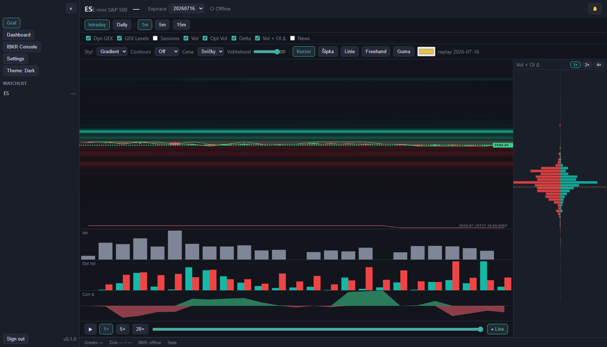
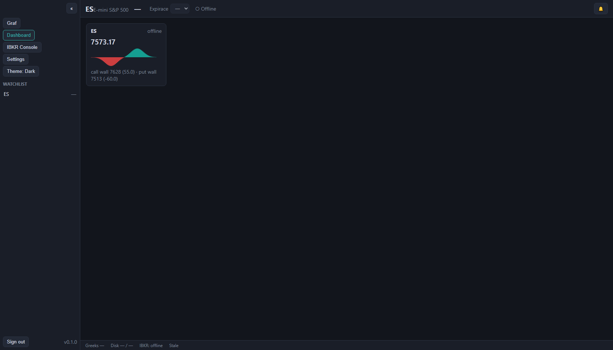
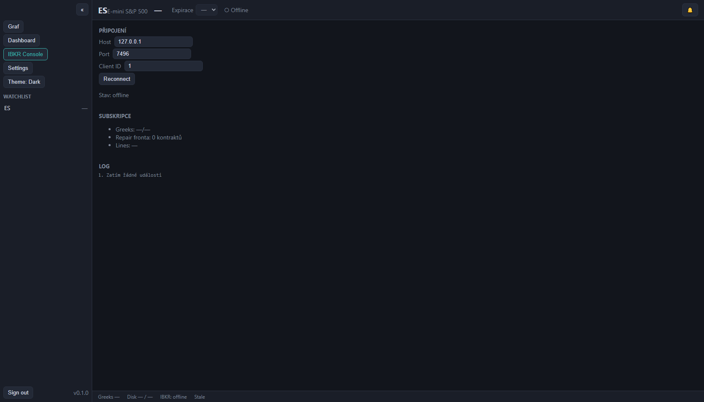
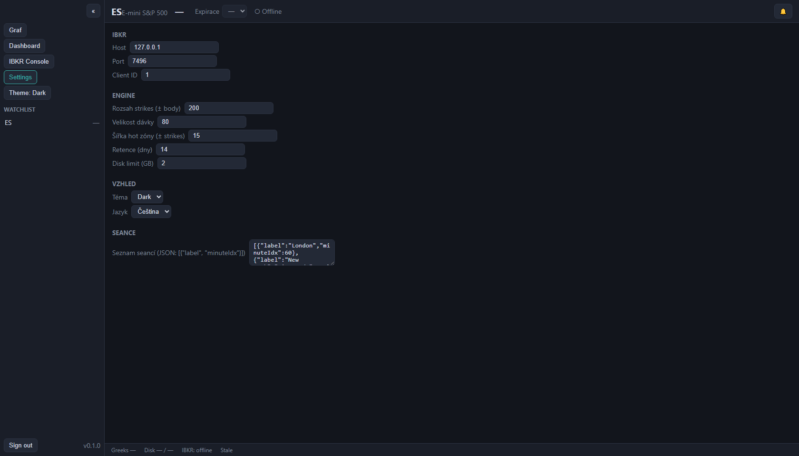
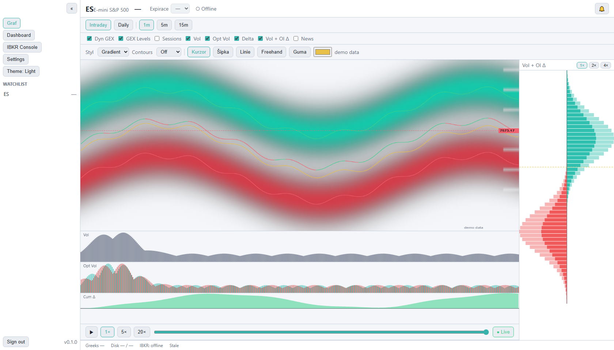

# GEXLens — Uživatelský manuál

*Verze 1.0 · červenec 2026 · pro aplikaci GEXLens v0.1*

GEXLens je aplikace pro intradenní tradery ES (E-mini S&P 500) futures opcí. Vizualizuje **opční positioning** — kde sedí koncentrace open interestu a volume, kde je zero-gamma flip, kde jsou call/put walls — a jak se to všechno vyvíjí v čase. Jediným zdrojem dat je tvůj účet u **Interactive Brokers** (TWS/IB Gateway API); žádná data neodcházejí mimo tvůj počítač.

---

## Obsah

1. [Co aplikace umí](#1-co-aplikace-umí)
2. [Co potřebuješ před prvním spuštěním](#2-co-potřebuješ-před-prvním-spuštěním)
3. [Spuštění a vypnutí aplikace](#3-spuštění-a-vypnutí-aplikace)
4. [Hlavní obrazovka — Graf](#4-hlavní-obrazovka--graf)
5. [Heatmapa podrobně](#5-heatmapa-podrobně)
6. [Cenová vrstva — křivka a svíčky](#6-cenová-vrstva--křivka-a-svíčky)
7. [Strike profil (pravý panel)](#7-strike-profil-pravý-panel)
8. [Spodní panely — Vol, Opt Vol, Cum Δ](#8-spodní-panely--vol-opt-vol-cum-δ)
9. [Playback — přehrávání dne](#9-playback--přehrávání-dne)
10. [Anotace — kreslení do grafu](#10-anotace--kreslení-do-grafu)
11. [Dashboard](#11-dashboard)
12. [IBKR Console](#12-ibkr-console)
13. [Settings](#13-settings)
14. [Notifikace a alerty](#14-notifikace-a-alerty)
15. [Stavová lišta — co znamenají údaje](#15-stavová-lišta--co-znamenají-údaje)
16. [Deep-linky](#16-deep-linky)
17. [Řešení potíží](#17-řešení-potíží)
18. [Slovníček pojmů](#18-slovníček-pojmů)

---

## 1. Co aplikace umí

- **Heatmapa čas × strike** — barevná mapa opčního positioningu přes celý obchodní den. Zelená (teal) = call strana, červená = put strana. Sedm přepínatelných metrik (OI, volume OTM/ITM, kombinace…).
- **GEX úrovně** — automaticky počítaný **flip** (zero-gamma), **call wall**, **put wall** a **centroid**, vykreslované jako linie přímo v heatmapě a průběžně přepočítávané každou minutu.
- **Živý tok** — kumulativní delta flow (Cum Δ) s klasifikací agresora: kdo tlačí, jestli kupci nebo prodejci.
- **Replay** — slider přetočí celý den zpět a přehraje vývoj positioningu rychlostí 1×/5×/20×.
- **Anotace** — šipky, linie a kreslení od ruky přímo do grafu; uložené k instrumentu a dni, přežijí restart.
- **Dashboard, IBKR Console, Settings** — provozní obrazovky pro přehled, diagnostiku a konfiguraci.


---

## 2. Co potřebuješ před prvním spuštěním

Kompletní checklist je v GitHub issue [#1 — Setup uživatelského prostředí](https://github.com/kEchiCZ/GEX/issues/1). Stručně:

1. **Účet u Interactive Brokers** s aktivní market data subskripcí **CME Real-Time – North America** (levná L1 varianta za ~1.55 USD/měs. stačí — ověřeno).
2. **TWS nebo IB Gateway** nainstalované, přihlášené a se zapnutým API:
   - *Edit → Global Configuration → API → Settings* → ✅ **Enable ActiveX and Socket Clients**
   - Socket port **7496** (live) / **7497** (paper)
   - Do *Trusted IPs* přidej `127.0.0.1`
   - *Read-Only API* nech zapnuté — GEXLens nikdy neobchoduje, jen čte data
3. **Docker Desktop** (na Windows s WSL2 backendem).

> ⚠️ **Jedno přihlášení na username:** když se stejným IBKR loginem přihlásíš jinde (mobil, druhé PC), TWS na tomto počítači spadne a aplikace ztratí data. Po návratu se stačí v TWS znovu přihlásit — aplikace se připojí sama.

---

## 3. Spuštění a vypnutí aplikace

### Ikonou na ploše (doporučeno)

Poklepej na ikonu **GEXLens** na ploše. Skript spustí všechny služby na pozadí a otevře prohlížeč na adrese aplikace. První start po vypnutí počítače trvá ~30–60 s.

### Ručně (PowerShell)

```powershell
cd "D:\Documents\Visual Studio Code\GEX"
docker compose up -d        # start na pozadí
# prohlížeč: http://127.0.0.1:8080
```

### Vypnutí

```powershell
docker compose stop         # zastaví služby (data zůstávají)
```

Aplikaci můžeš nechat běžet trvale — engine sbírá data, jen když běží a je přihlášené TWS; mimo seance prostě čeká.

### Pořadí při startu dne

1. Zapni/přihlas **TWS** (nebo IB Gateway)
2. Spusť **GEXLens** (pokud neběží)
3. Do minuty se ve stavové liště objeví `IBKR: connected` a začnou přibývat data

---

## 4. Hlavní obrazovka — Graf

Obrazovka se skládá z (shora dolů, zleva doprava):

| Prvek | Popis |
|---|---|
| **Sidebar (vlevo)** | Přepínání obrazovek (Graf / Dashboard / IBKR Console / Settings), přepínač tématu Dark/Light, **editovatelný watchlist** (kliknutí na ticker přepne instrument, × odebere, políčko dole přidá nový), verze. Tlačítkem « se sbalí. |
| **Hlavička** | Ticker a název instrumentu, poslední cena, **selektor expirace** (tradingClass + datum), indikátor ● Live / ○ Offline, zvonek notifikací. |
| **Řádek timeframe** | **Intraday/Daily** a rozlišení **1m, 2m, 3m, 5m, 10m, 15m, 30m, 45m, 1h, 2h, 3h, 4h, 1d**. Intraday agreguje minutová data do zvolených košů (svíčky OHLC, objemy se sčítají); Daily zobrazí sloupec za každý uložený den (roste s historií, max 14 dní). |
| **Řádek přepínačů** | Checkboxy vrstev: **Dyn GEX** (walls linie), **GEX Levels** (flip/centroid), **Sessions** (markery seancí), **Vol / Opt Vol / Delta** (spodní panely), **Vol + OI Δ**, **News**. Co odškrtneš, zmizí — layout se přeskládá. |
| **Lišta grafu** | Styl heatmapy (Gradient/Blobs), Contours (Off/Major/All), **Cena** (Křivka/Svíčky) + **Viditelnost**, nástroje anotací + barva, indikátor zdroje dat (live/replay/demo). |
| **Heatmapa** | Hlavní plocha — viz kapitola 5. |
| **Strike profil** | Pravý panel — viz kapitola 7. |
| **Spodní panely** | Vol / Opt Vol / Cum Δ — viz kapitola 8. |
| **Playback lišta** | Slider dne, ▶, rychlosti, návrat na Live — viz kapitola 9. |
| **Stavová lišta** | Zdraví datové pipeline — viz kapitola 15. |

---

## 5. Heatmapa podrobně

Heatmapa zobrazuje matici **čas (osa X) × strike (osa Y)**. Každá buňka je jedna minuta jednoho striku; intenzita barvy odpovídá hodnotě zvolené metriky. **Teal/zelená = call strana, červená = put strana.**

### Ovládání myší (styl TradingView)

| Akce | Efekt |
|---|---|
| Kolečko nad plochou | Zoom obou os **ukotvený ke kurzoru** (bod pod myší zůstává na místě) |
| Kolečko nad pruhem osy | Zoom **jen dané osy** (levý okraj = osa strikes, spodní okraj = osa času) |
| Tažení za pruh osy Y (levý okraj) | Roztahování/stahování cenové osy — zvětší/zmenší svíčky svisle |
| Tažení za pruh osy X (spodní okraj) | Roztahování/stahování časové osy — zvětší/zmenší svíčky vodorovně (kotva u pravého okraje: poslední svíčka drží pozici) |
| Tažení v ploše | Posun (pan) |
| **Dvojklik** nebo tlačítko **⟲** (pravý horní roh) | **Reset zobrazení** na výchozí pohled |
| Pohyb myší | Crosshair — svislá/vodorovná linka synchronizovaná se strike profilem i spodními panely + tooltip buňky (minuta, strike, hodnoty call/put) |

Spodní panely (Vol / Opt Vol / Cum Δ) **sledují časovou osu heatmapy** — při posunu či zoomu osy X se roztahují synchronně.

### Styl vykreslení

- **Gradient** — hladké bilineární přechody (výchozí)
- **Blobs** — gaussovské „bubliny“ kolem koncentrací; zvýrazní ohniska positioningu

### Contours (izolinie)

Bílé přerušované vrstevnice nad vyhlazeným polem:
- **Off** — vypnuto
- **Major** — dvě úrovně (p75 a p90) — jen hlavní koncentrace
- **All** — pět úrovní — detailní tvar

### Linie v heatmapě (overlaye)

| Linie | Barva | Zapíná |
|---|---|---|
| **Flip (zero-gamma)** | žlutá | GEX Levels |
| **Centroid (HVL)** | fialová | GEX Levels |
| **Call wall** | zelená | Dyn GEX |
| **Put wall** | červená | Dyn GEX |
| **Sessions markery** | šedé svislé | Sessions |
| **Cenová vrstva** | zelená/červená | vždy (viz kap. 6) |

Vpravo na ose je **štítek aktuální ceny**; v pravém dolním rohu **timestamp** posledních dat.

### Stale buňky

Pokud se některý strike nepodařilo obnovit (výpadek dat), jeho buňky jsou **vyšedlé s nižší sytostí** — poznáš tak stará data od živých. Souhrn běží ve stavové liště (`Repair: retrying N…`).

---

## 6. Cenová vrstva — křivka a svíčky

V liště grafu volbou **Cena**:

- **Křivka** (výchozí) — spojitá 1m linie zbarvená podle směru ticku (zelená nahoru, červená dolů). V husté heatmapě nejčitelnější.
- **Svíčky** — plnohodnotné 1m OHLC svíčky (knot high–low, tělo open–close).

Posuvníkem **Viditelnost** (10–100 %) cenovou vrstvu zeslabíš, aby nepřebíjela heatmapu pod ní — užitečné hlavně u svíček. **Štítek aktuální ceny zůstává vždy plně viditelný.**



---

## 7. Strike profil (pravý panel)

Horizontální skládané pruhy pro každý strike (stejná osa strikes jako heatmapa, nejvyšší nahoře):

- **Call doprava (teal), put doleva (červená)** od symetrické osy
- Každý pruh má dvě složky odlišené sytostí: **Vol** (sytá) a **OI Δ** (světlejší)
- **Žlutá přerušovaná linka** = aktuální cena
- Tlačítka **1× / 2× / 4×** zvětšují měřítko pruhů
- Najetí myší na řádek zvýrazní strike v celé aplikaci (crosshair) a dole zobrazí **tooltip**: OI call/put, Vol call/put, vzdálenost od spotu

Čteš z něj na první pohled, **kde sedí dominantní call a put koncentrace** — typicky walls.

---

## 8. Spodní panely — Vol, Opt Vol, Cum Δ

Tři panely se **sdílenou časovou osou** s heatmapou. Každý zvlášť vypneš checkboxem v horní liště (Vol / Opt Vol / Delta).

| Panel | Co ukazuje |
|---|---|
| **Vol** | Minutový objem podkladu (ES futures) — šedé sloupce |
| **Opt Vol** | Minutový objem opcí, **barevně call (teal) / put (červená)** vedle sebe |
| **Cum Δ** | Kumulativní delta flow jako plocha **nad nulou (zelená) / pod nulou (červená)**. Roste = agresivní kupci call delty / prodejci put delty; klesá = opačně. Počítá se s plnou klasifikací agresora (tick-by-tick v hot zóně, midpoint test jinde) a resetuje se na začátku dne. |

Pohyb myší v kterémkoli panelu hýbe crosshairem ve všech panelech i heatmapě.

---

## 9. Playback — přehrávání dne

Lišta pod panely:

- **Slider** — táhni kamkoli v dni; heatmapa, strike profil i spodní panely se **synchronně přetočí** k danému okamžiku
- **▶ / ⏸** — automatické přehrávání; rychlosti **1× / 5× / 20×** (1× = 2 minuty dne za sekundu)
- **● Live** — skok zpět na aktuální okamžik; přehrávání na konci dne se zastaví samo

Celý den je po načtení v paměti — přetáčení je okamžité, bez čekání na server.

---

## 10. Anotace — kreslení do grafu

V liště grafu vyber nástroj:

| Nástroj | Použití |
|---|---|
| **Kurzor** | Běžný režim (pan/zoom/crosshair) |
| **Šipka** | Táhni od–do; šipka s hlavičkou |
| **Linie** | Táhni od–do; rovná čára |
| **Freehand** | Kresli od ruky |
| **Guma** | Klikni poblíž anotace — smaže ji |

Vedle nástrojů je **výběr barvy**. Anotace jsou ukotvené k **času a striku** (ne k pixelům) — drží na svém místě při zoomu, panu i přetáčení, **přežijí restart aplikace** a jsou uložené zvlášť pro každý instrument a den.

---

## 11. Dashboard

Karty instrumentů z watchlistu: aktuální cena, stav dat (● live / offline), **mini NetGEX profil** (zelené/červené sloupečky = čistý positioning po stricích) a vzdálenosti k call/put wall. Slouží jako rychlý přehled, když sleduješ víc instrumentů.



---

## 12. IBKR Console

Diagnostická obrazovka:

- **Připojení** — host/port/client ID, tlačítko **Reconnect** (vyžádá znovupřipojení enginu), aktuální stav spojení
- **Subskripce** — průběh Greeks (X/Y), velikost repair fronty, vytížení market data lines
- **Log** — chronologický záznam událostí (změny stavu spojení, alerty)

Sem se podívej jako první, když něco nevypadá dobře.



---

## 13. Settings

Změny se **ukládají okamžitě** (bez tlačítka Uložit) a engine si je průběžně přebírá:

| Sekce | Položky |
|---|---|
| **IBKR** | Host, port (7496 live / 7497 paper), client ID |
| **Engine** | Rozsah strikes (± body od spotu), velikost dávky subskripcí, šířka hot zóny, retence dat (dny), disk limit (GB) |
| **Vzhled** | Téma **Dark/Light** (přepne se ihned), jazyk |
| **Seance** | Seznam sessions markerů pro heatmapu (JSON) |



Light téma:



---

## 14. Notifikace a alerty

**Zvonek** v hlavičce ukazuje badge s počtem nepřečtených alertů; kliknutím otevřeš historii (otevření badge vynuluje). Alerty chodí i za běhu do IBKR Console logu.

Druhy alertů:

| Alert | Kdy |
|---|---|
| Cena × úroveň | Cena protne flip nebo wall |
| Cum Δ skok | Skok kumulativní delty o nastavený práh |
| Dominantní strike | Změna striku s největší koncentrací |
| Výpadek spojení | TWS/Gateway nedostupné |
| Disk limit | Překročen limit místa na disku |
| **OI nedorazilo** | IBKR nedodalo Open Interest — GEX vrstvy jedou dočasně z volume (viz Řešení potíží) |

---

## 15. Stavová lišta — co znamenají údaje

| Údaj | Význam | V pořádku |
|---|---|---|
| `Greeks X/Y` | Kolik kontraktů řetězce má kompletní data (bid/ask/volume/Greeks) | X = Y |
| `Repair: retrying N…` | Kontrakty čekající na opakované načtení | Nezobrazuje se, nebo malé N |
| `Lines NN %` | Vytížení market data lines účtu | < 100 % |
| `Disk X / Y` | Obsazení disku daty / limit | X < Y |
| `IBKR: connected :7496` | Stav spojení + port | connected |
| `● Live HH:MM` / `Stale` | Čas posledních dat | ● Live, čas se hýbe |

---

## 16. Deep-linky

Aplikaci lze otevřít rovnou v konkrétním stavu pomocí URL parametrů:

```
http://127.0.0.1:8080/?view=dashboard          # obrazovka: chart | dashboard | console | settings
http://127.0.0.1:8080/?theme=light             # téma
http://127.0.0.1:8080/?price=candles&opacity=60  # svíčky s viditelností 60 %
```

Parametry lze kombinovat.

---

## 17. Řešení potíží

| Příznak | Příčina a řešení |
|---|---|
| Stavová lišta `IBKR: offline` | TWS neběží / není přihlášené / vypnuté API / špatný port. Zkontroluj TWS, pak IBKR Console → Reconnect. |
| Alert „delayed market data“ | Chybí live subskripce CME v Client Portal (viz kap. 2). |
| `Stale` místo `● Live` | Data se přestala hýbat — obvykle výpadek TWS↔IB (v TWS bývá hláška o connectivity). Vyřeší se samo, případně re-login TWS. |
| Lišta grafu ukazuje „demo data“ | Aplikace se nedostala k API / žádná data pro dnešek. Zkontroluj, že služby běží (`docker compose ps`) a engine je online. |
| **Alert „OI nedorazilo“** | IBKR dodává Open Interest pro ES opce jen jednou denně (ráno, po publikaci CME). Do té doby heatmapa jede z volume a GEX úrovně mohou být ploché. Engine to zkouší každých 30 minut sám — není třeba nic dělat. |
| Prázdná heatmapa | Mimo obchodní hodiny nevznikají nové snapshoty — použij playback pro přehrání posledního dne. |
| TWS spadlo po přihlášení na mobilu | Limit jednoho přihlášení IBKR. Znovu se přihlas v TWS; aplikace se sama připojí. |
| Aplikace nejde otevřít (:8080) | `docker compose up -d` v adresáři projektu; první start po rebootu chvíli trvá. |

---

## 18. Slovníček pojmů

| Pojem | Význam |
|---|---|
| **GEX** (Gamma Exposure) | Odhad, kolik dolarů musí dealeři hedgeovat na 1 bod pohybu podkladu. Kladný = dealeři tlumí pohyb, záporný = zesilují. |
| **Flip (zero-gamma)** | Cena, kde kumulativní NetGEX prochází nulou — hranice mezi režimem komprese a expanze volatility. |
| **Call wall / Put wall** | Strike s největší kladnou/zápornou koncentrací NetGEX nad/pod spotem — typicky funguje jako rezistence/support/magnet. |
| **Centroid (HVL)** | Vážené těžiště |NetGEX| profilu. |
| **OI (Open Interest)** | Počet otevřených kontraktů; mění se jednou denně. |
| **Cum Δ** | Kumulativní delta flow — součet (směr obchodu × velikost × delta × multiplikátor) přes den. |
| **Hot zóna** | Pásmo ATM strikes sledované tick-by-tick pro přesnou klasifikaci agresora. |
| **Stale** | Data starší než 5 minut — vizuálně odlišená. |

---

*GEXLens · dokumentace je součástí repozitáře [kEchiCZ/GEX](https://github.com/kEchiCZ/GEX). Technický manuál pro správce a vývojáře: `docs/manual/ADMIN-MANUAL.md`.*
