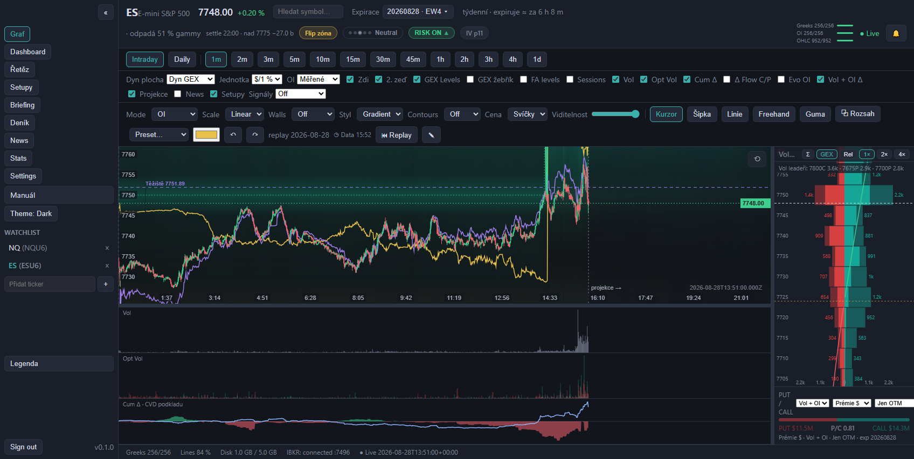
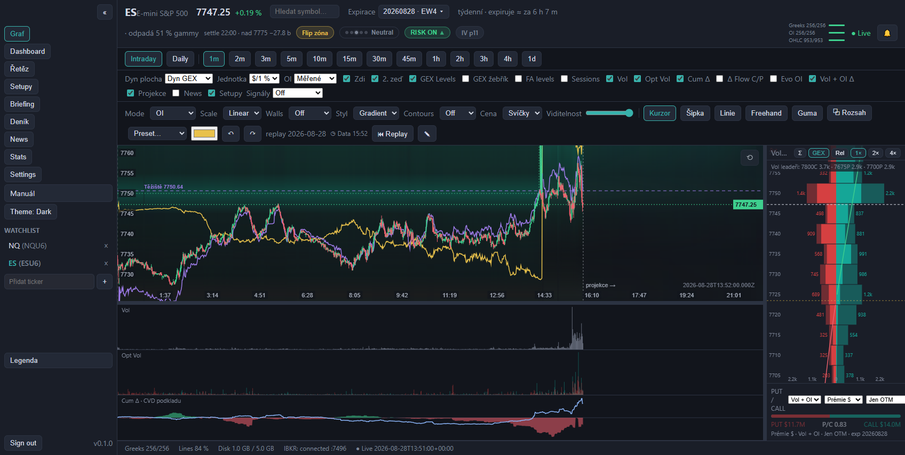
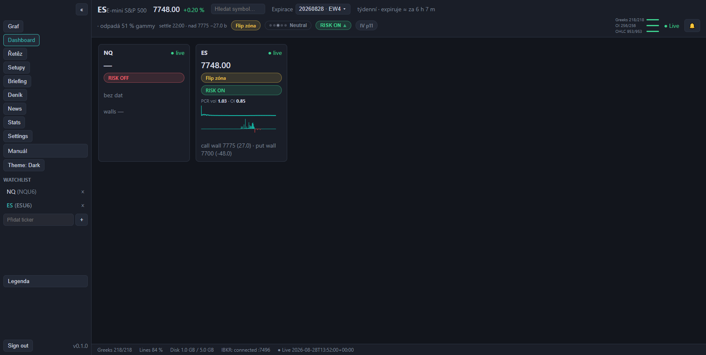
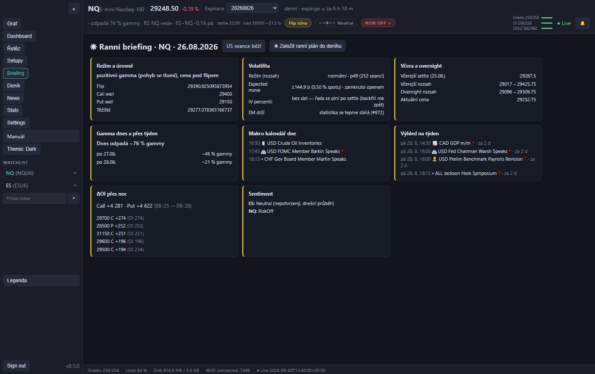
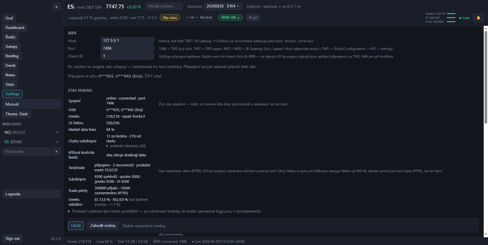
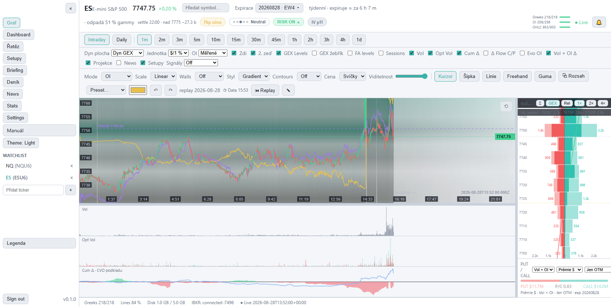
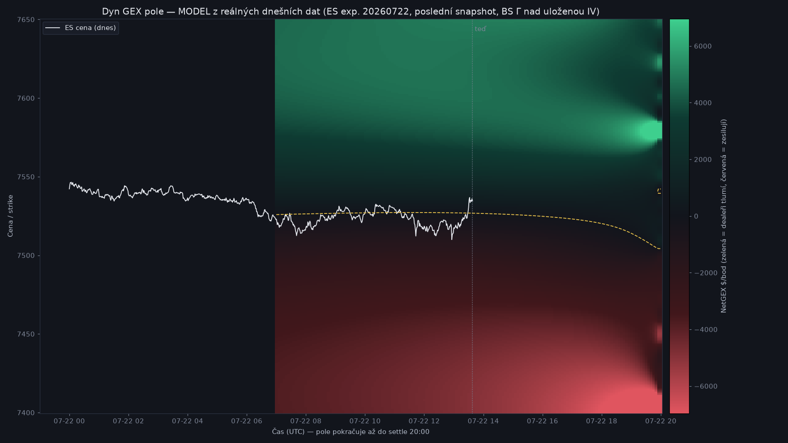

# GEXLens — Uživatelský manuál

*Verze 1.13 · září 2026 · pro aplikaci GEXLens v0.1*

GEXLens je aplikace pro intradenní tradery futures opcí (ES, NQ a další CME podklady). Vizualizuje **opční positioning** — kde sedí koncentrace open interestu a volume, kde je zero-gamma flip, kde jsou call/put walls a Max Pain — a jak se to všechno vyvíjí v čase. Hlavním zdrojem dat je tvůj účet u **Interactive Brokers** (TWS/IB Gateway API); od verze 1.9 slouží **tastytrade** jako záloha, která převezme data, když IBKR přestane posílat (kap. 17). Žádná data neodcházejí mimo tvůj počítač.

---

## Obsah

1. [Co aplikace umí](#1-co-aplikace-umí)
2. [Co potřebuješ před prvním spuštěním](#2-co-potřebuješ-před-prvním-spuštěním)
3. [Spuštění a vypnutí aplikace](#3-spuštění-a-vypnutí-aplikace)
4. [Hlavní obrazovka — Graf](#4-hlavní-obrazovka--graf)
5. [Heatmapa podrobně](#5-heatmapa-podrobně)
6. [Cenová vrstva — křivka a svíčky](#6-cenová-vrstva--křivka-a-svíčky)
7. [Strike profil (pravý panel)](#7-strike-profil-pravý-panel)
8. [Spodní panely — Vol, Opt Vol, Cum Δ, Evo OI](#8-spodní-panely--vol-opt-vol-cum-δ-evo-oi) · [8b. Časové okno — Rozsah ⧉](#8b-časové-okno--rozsah-)
9. [Playback — přehrávání dne](#9-playback--přehrávání-dne)
10. [Anotace — kreslení do grafu](#10-anotace--kreslení-do-grafu)
11. [Dashboard](#11-dashboard) · [11b. Řetěz](#11b-řetěz--greeks--oi-tabulka) · [11c. News a sentiment](#11c-news-a-sentiment-sentimentlens) · [11d. Signály a Stats](#11d-signály-a-stats) · [11e. Deník a Traders mode](#11e-deník-tradera-a-traders-mode) · [11f. Ranní briefing](#11f-ranní-briefing-sidebar--briefing)
12. [IBKR Console — zrušena](#12-ibkr-console--zrušena-sloučeno-do-settings)
13. [Settings](#13-settings)
14. [Notifikace a alerty](#14-notifikace-a-alerty)
15. [Stavová lišta — co znamenají údaje](#15-stavová-lišta--co-znamenají-údaje)
16. [Deep-linky](#16-deep-linky)
17. [Řešení potíží](#17-řešení-potíží)
18. [Obchodní čtení — režimy trhu, Dyn GEX a flip](#18-obchodní-čtení--režimy-trhu-dyn-gex-a-flip)
19. [Slovníček pojmů](#19-slovníček-pojmů)

---

## 1. Co aplikace umí

- **Heatmapa čas × strike** — barevná mapa opčního positioningu přes celý obchodní den. Zelená (teal) = call strana, červená = put strana. Devět přepínatelných metrik (**Mode**: OI, Vol OTM/ITM, Vol ±, OI+OTM, OI−ITM, OI±All, VEX, VEX ±) a čtyři škály (**Scale**: Linear, √, Log, Pow⅓).
- **GEX úrovně** — automaticky počítaný **flip** (zero-gamma), **call wall**, **put wall**, **centroid** a **Max Pain**, vykreslované jako časové linie i horizontální úrovně s cenovkami, přepočítávané každou minutu. Volitelné **Walls** módy (Peak/Center/Smooth/Flip/Ridge).
- **Multi-instrument** — watchlist v sidebaru: přidej ticker (ES, NQ, RTY…) a engine ho začne sbírat **do několika sekund**; svíčky a Vol panel se zpětně doplní za celý den, opční data (OI, Greeks) běží od momentu přidání. Kliknutím přepínáš celou aplikaci.
- **Více expirací najednou** — vedle aktivního řetězu se sbírá i následující expirace (čtení positioningu příští seance) a pravý profil umí **Σ souhrn přes expirace**.
- **Živý tok** — kumulativní delta flow (Cum Δ) s klasifikací agresora + **Δ Flow C/P** (tok zvlášť za call/put stranu).
- **ΔOI vs. včera** — kde přes noc přibyly/ubyly otevřené pozice (tooltip profilu).
- **Replay** — skrytý za tlačítkem ⏮ Replay; slider přehraje vývoj dne rychlostí 1×/5×/20×. Aplikace defaultně jede vždy live.
- **Anotace** — šipky, linie a kreslení od ruky přímo do grafu; uložené k instrumentu a dni, přežijí restart.
- **News a sentiment (SentimentLens)** — vlastní news-engine sbírá zprávy a makro kalendář (ForexFactory, Fed RSS, zpravodajské feedy), klasifikuje směr a důležitost, počítá **SentIndex** a stav **RISK ON / RISK OFF**. V grafu markery zpráv (klik = dialog s detaily a dopadem Long/Short), obrazovka **News** s feedem a nadcházejícími událostmi.
- **Signály** — empiricky gate-ované Long/Short nápovědy ze zpráv (šipky na ceně); pouštějí se, až když daný typ zprávy má statisticky ověřenou reakci (n ≥ 30, Wilson LB > 0,50).
- **Tendence** — souhrnný chip v hlavičce (Strong Short … Strong Long) z 12 složek positioningu a toku, s rozpadem hlasů po kliknutí.
- **Setup detektor** — šablony T1–T5 a T7 (odraz od zdi, neúspěšný průraz, Max Pain pin, gamma momentum, divergenční spring, pokračování trendu) s kartou, liniemi v grafu, P/L evidencí a hodnocením.
- **Dashboard, Řetěz, Stats, Settings** — provozní obrazovky pro přehled, opční tabulku, statistiky a konfiguraci (stav enginu je v Settings).



---

## 2. Co potřebuješ před prvním spuštěním

Kompletní checklist je v GitHub issue [#1 — Setup uživatelského prostředí](https://github.com/kEchiCZ/GEX/issues/1). Stručně:

1. **Účet u Interactive Brokers** s aktivní market data subskripcí **CME Real-Time – North America** (levná L1 varianta za ~1.55 USD/měs. stačí — ověřeno).
2. **TWS nebo IB Gateway** nainstalované, přihlášené a se zapnutým API:
   - *Edit → Global Configuration → API → Settings* → ✅ **Enable ActiveX and Socket Clients**
   - Socket port **7496** (live) / **7497** (paper)
   - Do *Trusted IPs* přidej `127.0.0.1`
   - *Read-Only API* nech zapnuté — GEXLens nikdy neobchoduje, jen čte data
3. **Docker Desktop** (na Windows s WSL2 backendem).

> ⚠️ **Jedno přihlášení na username:** když se stejným IBKR loginem přihlásíš jinde (mobil, druhé PC), TWS na tomto počítači spadne a aplikace ztratí data. Po návratu se stačí v TWS znovu přihlásit — aplikace se připojí sama.

---

## 3. Spuštění a vypnutí aplikace

### Ikonou na ploše (doporučeno)

Poklepej na ikonu **GEXLens** na ploše. Skript spustí všechny služby na pozadí a otevře prohlížeč na adrese aplikace. První start po vypnutí počítače trvá ~30–60 s.

### Ručně (PowerShell)

```powershell
cd "D:\Documents\Visual Studio Code\GEX"
docker compose up -d        # start na pozadí
# prohlížeč: http://127.0.0.1:8080
```

### Vypnutí

```powershell
docker compose stop         # zastaví služby (data zůstávají)
```

Aplikaci můžeš nechat běžet trvale — engine sbírá data, jen když běží a je přihlášené TWS; mimo seance prostě čeká.

### Pořadí při startu dne

1. Zapni/přihlas **TWS** (nebo IB Gateway)
2. Spusť **GEXLens** (pokud neběží)
3. Do minuty se ve stavové liště objeví `IBKR: connected` a začnou přibývat data

---

## 4. Hlavní obrazovka — Graf

Obrazovka se skládá z (shora dolů, zleva doprava):

| Prvek | Popis |
|---|---|
| **Sidebar (vlevo)** | Přepínání obrazovek (Graf / Dashboard / Řetěz / Setupy / Briefing / Deník / News / Stats / Settings), odkaz **Manuál**, přepínač tématu Dark/Light, **editovatelný watchlist** (kliknutí na ticker přepne instrument, × odebere, políčko dole přidá nový; při chybě se pod formulářem ukáže hláška a seznam se sám srovná se serverem), tlačítko **Legenda** (modál s ukázkami všech prvků grafu a čtením „roste/klesá"), sekce **Nedávné** (v1.12, #521 — posledních 8 zobrazených symbolů, klik znovu otevře i ad-hoc pohled; od v1.13 jen symboly **mimo watchlist** — aktivní ad-hoc symbol je tu zvýrazněný a do watchlistu se nepřimíchává (#989), ostatní položky mají **křížek ×**, kterým vyhledaný symbol vyřadíš (#987); vyřazení se pamatuje, aktivní symbol vyřadit nejde — nejdřív přepni jinam; tooltip připomíná rozdíl „ad-hoc pohled" vs. „plný sběr jako watchlist"), verze. Tlačítkem « se sbalí. |
| **Hlavička — horní řádek** | **Kdo a za kolik**: ticker a název instrumentu, **poslední cena + denní změna v %**, **kalendářový selektor expirace** (v1.12, níže) s typem (denní/týdenní/měsíční/kvartální/EOM) a odpočtem „expiruje ≈ za X h" — velké expirace nesou velké OI. Vedle selektoru je **vyhledání symbolu** (v1.12, #521): našeptávač CME produktů, výběr otevře **ad-hoc pohled přes tastytrade** — positioning libovolného produktu bez přidání do watchlistu a bez spotřeby IBKR linek (kotace + OI + BS greeks z mid; bez objemů, flows a Cum Δ — ty nese jen plný sběr). Takový symbol nese štítek **„ad-hoc · tastytrade“** a žije, dokud je zobrazený (~3 min po odchodu se uklízí); pro trvalé sledování ho přidej do watchlistu. **Výběr položky z našeptávače pohled otevře rovnou** — Enter je potřeba jen při ručním dopsání celého symbolu (v1.13, #983). Aby ad-hoc symbol data skutečně dostal, drží si engine ve streamu tastytrade **rezervu na ~2 ad-hoc pohledy** (v1.13, #982; do té doby mohl při plném streamu tiše mlčet). V selektoru najdeš i **následující expiraci** (sbírá se souběžně — čtení positioningu příští seance). |
| **Hlavička — spodní řádek** | **V jakém je to stavu**: **GEX režim badge** (zelený fade / červený momentum / žlutá flip zóna; tooltip s playbook hintem; když flip leží **mimo měřené pásmo** — celý Dyn GEX profil je na jedné straně nuly — badge se od v1.13 neztratí, režim se odvodí ze znaménka profilu u spotu a tooltip to přizná, #864), **chip Tendence** (pětipásmová škála Strong Short … Strong Long; klik = rozpad hlasů 12 složek, zatím „nekalibrováno"), **chip stavu sentimentu** RISK ON / RISK OFF / NEUTRAL (klik = sparkline dnešního SentIndexu, MA5/MA10 a aktivní témata; tečka = nepotvrzená intradenní změna), **settle watch**, **chip gamma útesu** a vpravo **ukazatele pokrytí dat**, indikátor ● Live / ○ Offline a zvonek notifikací. |
| **Řádek timeframe** | **Intraday/Daily** a rozlišení **1m, 2m, 3m, 5m, 10m, 15m, 30m, 45m, 1h, 2h, 3h, 4h, 1d**. Intraday agreguje minutová data do zvolených košů (svíčky OHLC, objemy se sčítají); Daily zobrazí sloupec za každý uložený den (roste s historií, max 14 dní). |
| **Řádek přepínačů** | Dropdown **Dyn plocha** (Off / Dyn GEX / Dyn Charm / Dyn Vanna — modelované pole jako podklad heatmapy, kombinuje se s libovolným módem, kap. 18; **výchozí je Dyn GEX** (#837) — modelované gamma pole je hlavní přidaná hodnota nástroje, Off zvol, když chceš jen měřenou mapu). Checkboxy vrstev: **Zdi** (call/put wall linie), **2. zeď** (druhá nejsilnější koncentrace strany, tečkovaně), **GEX Levels** (flip/centroid/Max Pain + **OI zdi**, viz kap. 5), **GEX žebřík** (top významné striky jako barevné úrovně: zelené call nad cenou, červené put pod ní, s podílem na síle strany v cenovce; jen striky s dostatečnou dominancí), **FA levels** (flow-adjusted flip/walls z odhadu OI: ranní OI + dnešní klasifikovaný tok — ukazuje stěhování zdí dřív, než to potvrdí zítřejší OI), **Sessions** (automatické markery světových seancí), **Vol / Opt Vol / Cum Δ / Δ Flow C/P** (spodní panely), **Vol + OI Δ**, **Projekce**, **News** (markery zpráv + panel Sentiment) s dropdownem **Vše/Významné** (filtr markerů na importance ≥ 2), dropdown **Signály** (Off / NEWS / COMBINED — šipky Long/Short na ceně, kap. 11d). Co odškrtneš, zmizí — layout se přeskládá. |
| **Chipy stavu trhu** | **Settle watch** — segment „settle 22:00 · nad/pod X ±d b": klíčová úroveň dne (nejsilnější zeď dle dominance, silné mají přednost) a kolik bodů k ní zbývá; teze dne „uzavřeme nad X?" na jeden pohled. **Chip „odpadá X % gammy"** — kolik gammy dnešní expirací večer zmizí z trhu (běžný den ~15 %, před OPEX i přes 60 %); struktura, která dnes drží cenu, zítra nemusí existovat. |
| **Ukazatele pokrytí dat** | Tři drobné proužky **Greeks**, **OI** a **OHLC** s podílem „kolik z kolika". Zelený = úplné, žlutý = díra (část striků čeká na dopočet, nebo chybí svíčky), **ztlumený s pomlčkou = hodnotu teď nelze změřit** (typicky odpojené IBKR nebo pár vteřin po startu). Prvky **nemizí** — ukazatel, který zmizí, vypadá jako rozbité rozhraní, ne jako chybějící data. |
| **Přepínač OI** | **Měřené / FA odhad** — zdroj Open Interest pro heatmapu i profil (persistováno per symbol, default Měřené). FA odhad = OI dopočtené z klasifikovaného toku (netflow×α): k dispozici dřív než publikovaný archiv, ale je to odhad — při pochybnosti věř Měřeným. FA má i vlastní Dyn GEX plochu v dropdownu Dyn plocha a vlastní FA levels. |
| **Lišta grafu** | **Mode** (7 metrik heatmapy), **Scale** (Linear/√/Log/Pow⅓), **Walls** (Off/Peak/Center/Smooth/Flip/Ridge), Styl (Gradient/Blobs), Contours (Off/Major/All), **Cena** (Svíčky/Křivka) + **Viditelnost**, nástroje anotací + barva, indikátor zdroje dat, tlačítko **⏮ Replay**. |
| **Heatmapa** | Hlavní plocha — viz kapitola 5. |
| **Strike profil** | Pravý panel; **předěl mezi grafem a panelem jde táhnout** (kurzor ↔) — viz kapitola 7. |
| **Spodní panely** | Vol / Opt Vol / Δ Flow / Cum Δ — viz kapitola 8. |
| **Playback lišta** | Defaultně skrytá (aplikace jede vždy live) — zobrazí ji tlačítko **⏮ Replay**; viz kapitola 9. |
| **Stavová lišta** | Zdraví datové pipeline — viz kapitola 15. |

### Kalendářový selektor expirace (v1.12)

Kliknutí na expiraci v hlavičce otevře **měsíční kalendář** místo plochého
seznamu dat. **Proč z pohledu tradera:** expirace se čte polohou v týdnu —
pátek = týdenní (větší OI), třetí pátek = měsíční/kvartální (největší), poslední
obchodní den = EOM. Seznam `YYYYMMDD` tuhle informaci schovává; v kalendáři
vidíš na jeden pohled, **jak daleko je nejbližší „velká" expirace** a jestli
mezi dneškem a plánovaným držením pozice nějaká neodpadá.

**Jak to číst:**

- Dny s expirací jsou tlačítka s **barevným okrajem podle druhu** (legenda dole:
  denní / týdenní / EOM / měsíční / kvartální), dnešek má čárkovaný rámeček,
  vybraná expirace je vyplněná.
- Tooltip dne nese druh + **trading class** série (E4C, EW4, EW…, z OI archivu)
  a případný zdroj tastytrade; trading class vybrané expirace je vidět přímo
  v tlačítku selektoru („20260828 · EW4").
- Den, kde se obchoduje **víc sérií se stejnou expirací** (např. MES), má v rohu
  počet a po kliknutí nabídne druhý krok s jmenovitým výběrem — heatmapa
  zobrazuje řetěz celého dne (série se slévají do jednoho positioningu).
- Šipky ‹ › (nebo PgUp/PgDn) listují měsíci, šipkové klávesy posouvají fokus
  po expiracích, Enter vybírá, Esc zavírá.

**Výchozí expirace a víkend (v1.13).** Po otevření aplikace se vybere
**nejbližší expirace ≥ den seance** — ve všední den tedy dnešní 0DTE řetěz,
v neděli po otevření Globexu (17:00 CT) rovnou pondělní (#945; dřív se
o víkendu omylem vybírala nejvzdálenější expirace z řady tastytrade, pro
kterou se nic nesbírá, a graf spadl na demo data). Když pro vybranou
expiraci **není uložený ani jeden den** (sobota, neděle před otevřením,
svátek), otevře se **poslední seance, která data má** — typicky páteční
(#946). Doskok se vždy ohlásí bannerem nad grafem s oběma daty: *„Pro
2026-08-31 nejsou uložená data — zobrazena poslední seance 2026-08-28. Mimo
obchodní dny je to očekávané; ve všední den to znamená, že sběr neběžel."*
Aplikace nezná kalendář svátků, podle data poznáš sám, jestli je to
v pořádku; ruční volba expirace v selektoru banner zruší. Čerstvě přidaný
ticker bez dat zůstává u vybrané expirace s hláškou demo dat.

---

## 5. Heatmapa podrobně

Heatmapa zobrazuje matici **čas (osa X) × strike (osa Y)**. Každá buňka je jedna minuta jednoho striku; intenzita barvy odpovídá hodnotě zvolené metriky. **Teal/zelená = call strana, červená = put strana.**

### Ovládání myší (styl TradingView)

| Akce | Efekt |
|---|---|
| Kolečko nad plochou | Zoom obou os **ukotvený ke kurzoru** (bod pod myší zůstává na místě) |
| Kolečko nad pruhem osy | Zoom **jen dané osy** (levý okraj = osa strikes, spodní okraj = osa času) |
| Tažení za pruh osy Y (levý okraj) | Roztahování/stahování cenové osy — zvětší/zmenší svíčky svisle |
| Tažení / kolečko na **pravém panelu** (profil) | **Ovládá stejnou cenovou osu Y** jako levý okraj — táhni svisle nebo kolečkuj přímo nad profilem (kurzor ↕) |
| Tažení za pruh osy X (spodní okraj) | Roztahování/stahování časové osy — zvětší/zmenší svíčky vodorovně (kotva u pravého okraje: poslední svíčka drží pozici) |
| Tažení v ploše | Posun (pan) |
| **Dvojklik** nebo tlačítko **⟲** (pravý horní roh) | **Reset zobrazení** na výchozí pohled |
| Pohyb myší | Crosshair — svislá linka snapnutá na svíčku, vodorovná sleduje kurzor; synchronizovaný se strike profilem i spodními panely + tooltip buňky (minuta, strike, hodnoty call/put) |

Crosshair navíc ukazuje **osové štítky jako TradingView**: dole na ose X **datum + čas** pod svislou linkou, vpravo na ose Y **cenu** na úrovni kurzoru. Cena je zaokrouhlená na **minimální tick instrumentu** (ES/NQ = 0,25) — mezi 7530,00 a 7530,25 tedy nic není. Crosshair **zůstává viditelný i mimo svíce** — když posuneš graf a jedeš myší přes prázdnou/budoucí plochu, nezmizí.

**Pohled se nesmýká sám.** Graf se automaticky napasuje (fit na cenové pásmo + ukotvení historie) **jen při změně datasetu** — jiný symbol, expirace, timeframe nebo den. Resize pravého panelu, živý přírůstek minut ani úprava os **tvůj pan/zoom nepřepíšou**. Kdykoli se vrátíš na napasovaný pohled dvojklikem nebo tlačítkem ⟲.

Spodní panely (Vol / Opt Vol / Cum Δ) **sledují časovou osu heatmapy** — při posunu či zoomu osy X se roztahují synchronně.

### Mode — devět metrik heatmapy

Select **Mode** přepíná, co buňky zobrazují (přepočet je okamžitý, bez čekání na server; dostupné nad živými/replay daty):

| Mode | Co ukazuje |
|---|---|
| **OI** | Open interest per strike (výchozí). Dokud ranní OI nedorazí, automaticky se použije volume. |
| **Vol OTM** | Volume jen OTM opcí (call nad spotem, put pod spotem) — čerstvá spekulace/zajištění |
| **Vol ITM** | Volume ITM opcí |
| **Vol ±** | Rozdíl call − put volume (zeleno-červená divergenční mapa) |
| **OI+OTM** | Vážená kombinace OI (60 %) a OTM volume (40 %) — „kde sedí i kde se dnes hraje" |
| **OI−ITM** | OI očištěné o ITM volume |
| **OI±All** | Rozdíl call − put OI (divergenční) |
| **VEX** | Vega Exposure = vega × OI per strana — kolik $ přecenění drží dealeři na striku při změně IV o 1 bod. Strikes s velkou VEX = „volatility walls": při skoku IV (zprávy, FOMC) se tam nejvíc přehedgovává. Před událostmi relevantnější než OI mapa. |
| **VEX ±** | Rozdíl call − put VEX (divergenční zobrazení vega rizika) |


Select **Scale** mění škálu hodnot: **Linear**, **√** (zvýrazní slabší), **Log**, **Pow⅓**. Znaménko se zachovává.

**Nápověda při dominanci jedné strany (v1.12).** Když na Linear jedna strana převyšuje druhou víc než 5 : 1 (na 0DTE běžná situace), slabší struktura splyne do tmy — vypadá to, že pod cenou „nic není", přitom tam koncentrace jsou, jen je přebila normalizace. Vedle Scale se pak objeví hint „cally dominují 12 : 1 — zkus √ nebo Log": klik přepne škálu a slabší strana se vynoří, **aniž by se s daty cokoli dělalo**. Škála se nikdy nepřepíná sama (je to tvoje volba) a hint jde křížkem trvale zavřít.

**Sytost projekce klesá se vzdáleností (v1.12).** Projekční zóna (kap. 18, ADR-0006) je spočítaná ze zmrazeného „teď" — pár košů dopředu je solidní odhad, konec horizontu spíš náčrt. Dřív měla celá projekce jednu sníženou sytost; teď sytost od předělu Today lineárně klesá, takže míra blednutí přímo říká, jak moc modelu věřit. Na denní ose je to nejdůležitější — rozdíl mezi „zítra" a „za měsíc" je zásadní.

### Walls — detekce zdí

Select **Walls** kreslí bílé čárkované linie počítané z právě zobrazené vrstvy:

- **Peak** — strike s maximem metriky per minuta (call i put strana)
- **Center** — vážené těžiště per minuta
- **Smooth** — vyhlazený Peak (EMA 15 minut)
- **Flip** — kopie zero-gamma řady
- **Ridge** — souběžné hřebeny koncentrací (víc zdí najednou, s filtrem šumu)

### Styl vykreslení

- **Gradient** — hladké bilineární přechody (výchozí)
- **Blobs** — gaussovské „bubliny“ kolem koncentrací; zvýrazní ohniska positioningu

### Contours (izolinie)

Bílé přerušované vrstevnice nad vyhlazeným polem. Prahy jsou **procenta síly
z 99. percentilu pole, zvlášť za kladnou a zápornou stranu** — na každé straně
tedy vždy uvidíš dvě čáry bez ohledu na to, jak silný den je:
- **Off** — vypnuto
- **Major** — úrovně 65 % a 95 % — jen jádra koncentrací
- **All** — úrovně 40 % a 70 % — širší obrys struktury

**Major a All nejsou „důležité vs. všechny" úrovně — je to jen posun obou
prahů.** Major kreslí užší obrys kolem nejsilnějších jader, All zachytí i
střední zóny. Počet čar je v obou případech stejný (dvě na stranu).

**Nad čím se kontury počítají:** vždy nad **právě zobrazeným polem**, ne nad
vlastním datovým zdrojem. Se zapnutou Dyn plochou obrysují modelované pole,
jinak měřený grid podle zvoleného Mode. Proto sedí na barvy — používají týž
jmenovatel (p99) jako barevná škála.

**Jak číst:**

| Kde je cena | Co to znamená |
|---|---|
| **nad oběma** čarami | uvnitř tlumící zóny — výkyvy se zaplácnou |
| **mezi čarami** | přechodové pásmo, tlumení slábne |
| **pod oběma** | mimo zónu — pohyb se rozjede snáz |

Vzdálenost obou čar nese informaci: **čím blíž jsou u sebe, tím ostřejší je
přechod** mezi „drží" a „pustilo" (podrobné čtení v kap. 18). Kontury jsou
**doplněk ke zdem, ne samostatný signál**: zdi říkají *kde* je hranice,
kontury *jak ostrá* je.

> **Pozor na záměnu:** kontury i **Walls módy** kreslí stejným stylem (bílá
> čárkovaná). Rozeznáš je podle tvaru — kontury jsou uzavřené křivky kolem
> koncentrací, walls jsou linie vedené zleva doprava.

### Linie v heatmapě (overlaye)

| Linie | Barva | Zapíná |
|---|---|---|
| **Flip (zero-gamma)** | žlutá | GEX Levels |
| **Centroid (HVL)** | fialová | GEX Levels |
| **Max Pain** | magenta | GEX Levels (počítá se z OI) |
| **Call wall** | zelená | Zdi |
| **Put wall** | červená | Zdi |
| **2. zeď** | zelená/červená tečkovaná (bez cenovky) | 2. zeď |
| **OI zeď (call / put)** | jemně tečkovaná, studenější teal/růžová, v cenovce podíl na OI strany | GEX Levels (v1.13, níže) |
| **FA levels** | vlastní odstíny s prefixem FA | FA levels |
| **Walls módy** | bílé čárkované | select Walls |
| **Sessions markery** | šedé svislé (Tokio, Londýn, US Open…) | Sessions |
| **News markery** | svislé značky u spodní hrany + glyf kategorie | News |
| **Šipky signálů** | ▲ teal / ▼ červená na cenové křivce | Signály |
| **Cenová vrstva** | zelená/červená | vždy (viz kap. 6) |

Každá úroveň se navíc promítá jako **horizontální čárkovaná linka přes celou šířku s barevnou cenovkou** u levého okraje (poslední známá hodnota) — na první pohled vidíš, kde úrovně právě leží. Vpravo na ose je **štítek aktuální ceny**; v pravém dolním rohu **timestamp** posledních dat.

### OI zdi — jiná veličina než gamma zdi (v1.13, #851)

**Call/put zeď** je maximum gamma profilu — kde dealeři hedgují **právě teď**
a působí okamžitě přes tok. **OI zeď** je strike s největším **otevřeným
zájmem** na své straně (call nad spotem, put pod ním) — magnet k expiraci
a místo, kde se pozice zavírají. Gamma profil se počítá jen nad obálkou IBKR
(±200 b, strop market data linek), kdežto denní OI z tastytrade pokrývá celý
řetěz — masa OTM putů tak často leží **mimo dosah gamma zdí** a trader, který
podle zdi umisťuje stop, o ní jinak neví.

- **Nic se nedopočítává**: žádná IV ani gamma z extrapolace — bez OI se
  hladina prostě nekreslí. Proto se OI zdi nemíchají mezi gamma zdi.
- **Cenovka nese podíl na OI své strany**: nízké procento = plochý profil,
  „zeď" je jen nejvyšší z mnoha srovnatelných striků. **Slabé zdi (pod 20 %)
  se nekreslí vůbec** — práh leží v mezeře naměřeného rozdělení (hodnoty se
  drží kolem 11–15 %, pak skočí na 22–36 %).
- **Silná zeď mimo výřez** (naměřeno: call OI zeď 690 b nad spotem, put
  1 700 b pod ním) se ukáže jako **značka na horním/spodním okraji** se
  směrem, hodnotou a vzdáleností od kraje rozsahu — hladina, kterou nikdo
  nevidí, je k ničemu.
- **Jak číst:** shoda OI zdi s call/put zdí je silná úroveň; když se
  rozejdou, gamma zeď působí teď, OI zeď až k expiraci. Velké put OI pod
  trhem je místo, kde se pád má o co opřít, i bez gamma zdi — reakce ale
  nebývá tak okamžitá, protože to samo o sobě není hedging. Rozdíl obou
  veličin vysvětluje i **Legenda** v sidebaru.

### News markery — zprávy přímo v grafu

Se zapnutým **News** se na časové ose kreslí značky zpráv a makro událostí (krátký tick těsně nad pásem popisků seancí u spodní hrany + glyf kategorie nad ním: 🏛 Fed, 📊 inflace, 👷 trh práce…; od v1.13 mají pevnou výšku v pixelech a nerostou s výškou grafu — dřív zabíraly spodní třetinu plochy, #980; klik na marker trefí jen tenhle spodní pás, výš patří klik heatmapě):

- **Barva = změřený dopad**: teal kladný sentiment, červená záporný, šedá neutrální/nezměřený. **Jas a tloušťka = důležitost** — okrajová zpráva nekřičí jako FOMC.
- Víc zpráv v téže minutě = **jeden marker s počtem** (cluster).
- **Nadcházející plánované eventy** (CPI ve 14:30…) se kreslí **dutě čárkovaně do projekční zóny** vpravo od živé hrany — vidíš je dřív, než přijdou.
- **Klik na marker otevře dialog** se zprávami dané minuty: čas, kategorie, důležitost (! až !!!), titulek, případný souhrn a **očekávaný dopad na trh — Long ▲ / Short ▼ / Neutrální** (u klasifikovaných zpráv podle směru, jinak podle znaménka skóre; stejná logika, jakou se barví marker). U makro událostí navíc **očekávání / minule / výsledek**, u nadcházejících odpočet. Zavření: ×, Esc, nebo klik mimo.
- **Verdikt vydané makro události (v1.12):** jakmile dorazí výsledek, dialog pod čísly ukáže **„nižší/vyšší než očekávání (±X σ)"** a při překvapení ≥ 0,5 σ i **směr → risk-on ▲ / risk-off ▼**. **Proč z pohledu tradera:** holé „2,7 vs 2,9" musíš v hlavě přepočítat přes polaritu řady (nižší CPI = dobrá zpráva, nižší payrolls = špatná) — přesně v minutách, kdy sleduješ reakci spotu; verdikt to udělá za tebe včetně velikosti překvapení v σ řady (−1,4 σ je jiná káva než −0,5 σ). **Jak číst:** šipka je odhad z konvence řady, ne signál — tooltip připomíná, že polarita je režimově závislá (v období „good news is bad news" se obrací); pod 0,5 σ se směr neukazuje vůbec, protože překvapení na úrovni šumu žádný směr nenese. Výsledek u high-impact událostí dorazí do ~1–2 minut od vydání (burst dotahování).
- Dropdown **Vše / Významné** vedle checkboxu News omezí markery jen na zprávy s **důležitostí ≥ 2** — plocha se nezahltí drobnými titulky, FOMC/CPI zůstávají.

### Stale buňky

Pokud se některý strike nepodařilo obnovit (výpadek dat), jeho buňky jsou **vyšedlé s nižší sytostí** — poznáš tak stará data od živých. Souhrn běží ve stavové liště (`Repair: retrying N…`).

---

## 6. Cenová vrstva — křivka a svíčky

V liště grafu volbou **Cena**:

- **Svíčky** (výchozí) — plnohodnotné OHLC svíčky (knot high–low, tělo open–close) v rozlišení zvoleného timeframe.
- **Křivka** — spojitá linie zbarvená podle směru ticku (zelená nahoru, červená dolů).

Graf se při načtení **automaticky napasuje na cenové pásmo dne** (svíčky vyplní výšku); okolní zóny heatmapy dosáhneš tažením/kolečkem za osu Y, reset vrací napasovaný pohled. Po startu s **málem dat** (ráno) mají svíčky **fixní šířku** ukotvenou k pravému okraji — neroztahují se přes celý graf jako dřív.

Posuvníkem **Viditelnost** (10–100 %) cenovou vrstvu zeslabíš, aby nepřebíjela heatmapu pod ní — užitečné hlavně u svíček. **Štítek aktuální ceny zůstává vždy plně viditelný.**

### Historie přes hranici dne — jen cena (v1.13, #788)

Bary podkladu se drží navždy (ES i NQ od července 2024), takže graf nekončí
začátkem dnešní seance: **doscrolluj doleva** a starší seance se dotáhnou
samy, den po dni, až na začátek archivu. Platí přitom:

- **Jen cena.** Heatmapa, profil ani spodní panely se pro minulé dny
  nestaví — positioning každého dne stojí na jiném 0DTE řetězu a míchat ho
  do dnešní osy by lhalo. Historie je **ztlumená** a na hranici dneška je
  popisek „← historie (jen cena)"; mezi dny jsou předěly s datem.
- **Kotva na dnešku:** dotažení staršího dne s pohledem nepohne ani o pixel.
  Dny stojí zády k sobě po obchodních minutách — víkend ani pauza CME
  nevyrábí mezeru.
- **Křivka nespojuje hranici dnů** — přes roll kontraktu by spojnice tvrdila
  falešnou kontinuitu (ADR-0028). Osa X nese časy i pro historii a crosshair
  ukazuje datum **toho** dne, ne dnešní.
- Cena před týdnem klidně leží mimo dnešní obálku ±200 b — historie se
  kreslí i mimo pásmo strikes, dnešní vrstvy se dál klampují k pásmu.

### Rekonstruované minuty po pozdním startu (v1.13, #617)

Když engine naběhne až po otevření seance (restart PC, TWS spuštěná pozdě),
chybějící minuty barů podkladu se **doplní z dxFeed** (tastytrade) — jedno
krátké spojení mimo živou datovou cestu, měřené minuty se nikdy nepřepisují.
Doplněný úsek ale **není měření** a nesmí splynout s naměřeným klidem, proto
nad grafem svítí banner: *„Rekonstruováno 14 min z dxFeed (12:03–12:16) —
cena a objem doplněné po pozdním startu, CumΔ za ten úsek chybí."* Ta poslední
věta je podstatná: svíčka nese OHLCV, ne printy s agresorem, takže **tok se
rekonstruovat nedá** (stejný princip jako šrafované chybějící OI). Opční vrstva
(Greeks, snapshoty) se zpětně nedoplňuje vůbec — IBKR ji historicky nedá
(ADR-0024). Banner jde zavřít křížkem a zůstane zavřený i po obnovení stránky;
znovu se ukáže jen při **jiné** množině rekonstruovaných minut (další
backfill, jiný den nebo symbol, #977).



---

## 7. Strike profil (pravý panel)

Horizontální skládané pruhy pro každý strike, **na stejné výškové ose jako heatmapa** — strike v profilu je vždy na stejné úrovni obrazovky jako v grafu a při zoomu/posunu osy Y se hýbou synchronně:

- **Call doprava (teal), put doleva (červená)** od symetrické osy; popisky **Put/Call** nahoře
- Každý pruh má dvě složky odlišené sytostí: **Vol** (sytá) a **OI Δ** (světlejší)
- U konce pruhů jsou **číselné hodnoty** (Δ-vážené kontrakty) — na každém k-tém řádku, ať se nepřekrývají. Pruhy končí kousek před okrajem, takže nepřetékají mimo panel.
- Dole **osa množství** (Δ-vážené kontrakty, formát „5k") — vidíš, jak velké zdi reálně jsou; měřítko reaguje na zoom
- **Šedá přerušovaná linka** = aktuální cena (spot)
- Tlačítko **GEX** = křivka modelovaného **Dyn GEX profilu** (zelená doprava = dealeři tlumí, červená doleva = zesilují); **žlutá přerušovaná linka** = **dynamický flip** (průchod křivky nulou). Detaily čtení: kapitola 18.
- Pod hlavičkou panelu běží readout **Vol leadeři** — top 3 strany (strike × C/P) podle opčního volume vybrané expirace, např. „7450P 4,1k · 7500P 2,9k". Sleduje playback i Σ souhrn; na zítřejší expiraci před eventem ukazuje, kde se trh zajišťuje (viz alert Vol koncentrace).
- Tlačítko **Rel / Abs** přepíná měřítko: **Rel** = normalizace na největší pruh ve výřezu (výchozí), **Abs** = zaokrouhlený „hezký" strop (kulaté hodnoty na ose, stabilnější délky pruhů mezi snímky)
- Tlačítka **1× / 2× / 4×** zvětšují měřítko pruhů
- Tlačítko **Σ** = souhrn přes všechny sbírané expirace tohoto instrumentu (pondělní + úterní řetěz…). Hlavička se změní na „Σ expirací"; heatmapa zůstává u zvolené expirace. Celkový positioning bez přepínání.
- Najetí myší na řádek zvýrazní strike v celé aplikaci (crosshair) a dole zobrazí **tooltip**: OI call/put, Vol call/put, **ΔOI vs. včera C/P** (kde přes noc přibyly/ubyly pozice; jen per expirace, v Σ režimu se neukazuje), vzdálenost od spotu
- **Šířku panelu změníš tažením předělu** mezi grafem a panelem (kurzor ↔). Panel jde roztáhnout hodně doleva (až ~360 px zbyde na graf), aby byla vidět celá délka pruhu i s číslem.
- **Profilem ovládáš i cenovou osu Y grafu** — tažení svisle nebo kolečko nad profilem stlačuje/roztahuje ceny stejně jako levý okraj heatmapy (kurzor ↕).

- **Šrafovaná půlka řádku** = OI pro tenhle strike **chybí** (IBKR ho nedodalo) — něco jiného než změřená nula, která zůstává prázdná. Šrafura říká „nevíme", prázdno říká „nula".

Čteš z něj na první pohled, **kde sedí dominantní call a put koncentrace** — typicky walls.

### PUT / CALL panel (pod profilem)

Poměr obou stran vybrané expirace ve třech jednotkách (dropdown): **Kontrakty**
(kusy), **Prémie $** (kolik peněz za pozice někdo zaplatil — mid × kontrakty ×
multiplikátor; OTM křídla s tisíci levných kusů nepřebijí ATM pozici za násobně
víc) a **Notional $** (nominál podkladu). Základ volíš druhým dropdownem:
Vol + OI / Vol / OI. Červený-zelený pruh ukazuje poměr, čísla PUT/CALL a P/C.
Zmrzlé kotace se do prémií nepočítají — při >30 % chybějících midů panel
zašedne s vysvětlením, aby prémie nelhala.

Třetí dropdown volí **rozsah striků**: **Jen OTM** (výchozí — call se počítá
jen nad spotem, put pod ním; ITM prémie je z velké části vnitřní hodnota, ne
sázka na směr, a umí poměr úplně zkreslit), **Vše**, nebo **Čas. hodnota**
(mid − intrinsic; má efekt jen u Prémie $). Bez známého spotu obě volby
poctivě padají na Vše. Popiska pod pruhem vždy říká, z čeho číslo vzniká.
S aktivním časovým oknem (kap. 8b) panel přepne na **okenní režim** — počítá
jen to, co se zobchodovalo v okně.

> **Kontrakty vs. Prémie $: proč se liší rozsah dat.** Řetěz sahá dál, než kam
> dosáhne měření. Striky mimo obálku IBKR nese **denní OI z tastytrade** — u nich
> známe otevřený zájem, ale ne kotace, takže **do Kontraktů vstupují, do Prémií
> ne** (bez midu nejde spočítat, kolik peněz v nich leží). Proto může Prémie $
> ukazovat výrazně jiný poměr než Kontrakty a být zašedlá: to není chyba, ale
> přiznání, že peněžní pohled má užší záběr. **Pro čtení celkového pozicování
> používej Kontrakty**, prémie ber jako pohled na to, kde se reálně obchoduje.

> **OI, Vol, nebo Vol + OI?** Každý základ odpovídá na jinou otázku.
> **OI** = co leží v knize z minula (pozicování). **Vol** = co se obchoduje dnes
> (čerstvý tok). **Vol + OI** obojí sčítá, což je pohodlné, ale míchá dvě
> veličiny dohromady. Zajímavý je hlavně _rozdíl_ mezi nimi: když je Vol
> výrazně nižší než OI (např. 0,37 proti 0,66), dnešní obchodování je
> callovější než stávající pozice — někdo cally nakupuje teď, neleží tam
> z minula.

> **Proč večer „zmizí" jedna strana pruhů?** Pruhy jsou **Δ-vážené** — násobí se deltou opce (kolik futures dealer na kontrakt reálně drží). Ke konci seance se delta polarizuje (viz gamma crunch, kap. 18): OTM opce mají deltu skoro 0, ITM skoro 1. Nad spotem proto zbývají hlavně červené (ITM puty) a pod spotem zelené (ITM cally). Není to chyba — surové OI/Vol obou stran pořád vidíš v tooltipu řádku; zapnutím **Σ** se přimíchá zítřejší expirace s měkčími deltami a obě strany se zase objeví.

---

## 8. Spodní panely — Vol, Opt Vol, Cum Δ, Evo OI

Panely se **sdílenou časovou osou** s heatmapou. Každý zvlášť vypneš checkboxem v horní liště (Vol / Opt Vol / Cum Δ / Δ Flow C/P / Evo OI). Od v1.12 se kumulativní delta jmenuje **Cum Δ všude stejně** — dřív měl checkbox název „Delta“ a panel „Opt Δ“, což byly tři názvy jedné věci.

| Panel | Co ukazuje |
|---|---|
| **Vol** | Minutový objem podkladu (futures) — šedé sloupce |
| **Opt Vol** | Minutový objem opcí, **barevně call (teal) / put (červená)** vedle sebe |
| **Δ Flow C/P** | Delta-vážený opční tok zvlášť za call a put stranu (\|Δ\| × přírůstek volume). Z něj čteš, **na které straně se právě obchoduje** — např. „uzavírání callů" = call sloupce slábnou. Default vypnutý (checkbox Δ Flow C/P). |
| **Cum Δ** | Kumulativní delta flow jako plocha **nad nulou (zelená) / pod nulou (červená)**. Roste = agresivní kupci call delty / prodejci put delty; klesá = opačně. Počítá se s plnou klasifikací agresora (tick-by-tick v hot zóně, midpoint test jinde) a resetuje se na začátku dne. |
| **Evo OI** | Vývoj celkového Open Interest v čase, zvlášť call (teal) a put (červená), **schodovité kreslení**. V Daily ose = hodnota na konci každého dne. Default vypnutý (checkbox Evo OI). Podrobně níže. |
| **Sentiment** | SentIndex z news-engine (zapíná checkbox **News**): intraday spojitá řada kolem nuly (kladná = risk-on tón zpráv, záporná = risk-off), v **Daily** pohledu OHLC svíčka indexu za každý den (open nese overnight zbytek). V replay staršího dne panel od v1.13 ukazuje řadu **zobrazeného dne** a při přetáčení drží osu s ostatními panely (dřív bral dnešní řadu a při přetáčení se posouval doleva, #976). |

**Ovládání panelů (v1.12).** Každý spodní panel jde ovládat myší jako graf:

- **vodorovné tažení** posouvá sdílenou časovou osu — hlavní graf i ostatní
  panely jedou s tím (stejné gesto jako tažení v heatmapě),
- **svislé tažení** posouvá hodnotovou osu **jen toho jednoho panelu**,
  přirozeným směrem (táhneš dolů → obsah jede dolů),
- **kolečko** zoomuje hodnotovou osu **jen toho panelu**, k pozici kurzoru,
- **dvojklik** vrátí panel do výchozího pohledu,
- osa vpravo i nulová linka respektují posunutý/zoomlý pohled — čtou pravdu.

Úchyt na spodní hraně panelu dál mění jeho **výšku** (každý panel zvlášť,
minimum 25 px, výšky se pamatují; globální předěl mezi grafem a panely výšky
opět sjednotí, #792) a předěl mezi grafem a panely zůstává beze změny.

Pohyb myší v kterémkoli panelu hýbe crosshairem ve všech panelech i heatmapě. Při najetí navíc uvidíš **hodnoty ukazatele**:

- **vpravo nahoře** hodnotu pro **minutu pod crosshairem** (Opt Vol a Δ Flow zvlášť C/P);
- **vpravo na ose Y** hodnotu podle **výškové úrovně kurzoru** (ne max daného času) + **vodorovnou crosshair linku** na té úrovni. U Cum Δ je škála znaménková kolem nuly.

### Evo OI podrobně — budují se pozice, nebo zavírají?

**„Evo" = evolution, tedy vývoj.** Panel je prostý součet Open Interestu přes
všechny striky vybrané expirace, minutu po minutě — teal call, červená put.
Jednotkou jsou **kontrakty**.

**Trojúhelníkový glyf u nadpisu je tlačítko, ne značka v grafu.** Je to
velké řecké **Δ** a přepíná režim svislé osy:

| Režim | Co osa ukazuje |
|---|---|
| **Δ** (výchozí) | **změnu od začátku osy** — křivka startuje na nule, hodnoty se znaménkem (`+30`, `−10`) |
| **abs** | **absolutní úroveň** OI v kontraktech |

Výchozí je Δ proto, že celkové OI se za den mění řádově o promile — v
absolutní škále by obě linky vypadaly jako rovné čáry a panel by nenesl
žádnou informaci.

**K čemu to je:** objem sám o sobě neřekne, jestli obchod pozici **otevřel,
nebo zavřel**. To dopoví až OI. Proto se Evo OI čte **vedle** panelů Opt Vol
a Δ Flow, ne samostatně:

- objem roste **a OI roste** → pozice se **budují**, zeď se staví;
- objem roste **a OI klesá** → **zavírání**, zeď se rozpouští.

> **Plochý úsek neznamená „nic se neděje".** OI chodí z IBKR přes tick 101
> jen občas (viz ADR-0001), a schodovité kreslení je záměr — šikmá spojnice
> by si vymýšlela průběh, který jsme nenaměřili. Vodorovný úsek tedy čti jako
> **„od posledního snímku nepřišla aktualizace"**.

Panel vždy ukazuje **měřené OI**; přepínač Měřené / FA odhad s ním nehýbe
(ten se týká heatmapy a strike profilu).

---

## 8b. Časové okno — Rozsah ⧉

Výběr okna [t1, t2] na časové ose: **profil vpravo a P/C panel se přepočítají
jen na to, co se zobchodovalo v okně** — „co se nakoupilo v první půlhodině po
openu", „co změnilo CPI". Vše se počítá lokálně, přepnutí je okamžité
a funguje i v replay.

### Ovládání

- **Vytvoření**: nástroj **⧉ Rozsah** v liště nástrojů a tažení v grafu — nebo
  kdykoli **Alt+tažení** bez přepínání nástroje.
- **Úprava hotového okna**: tažení **za okraj** mění tu stranu (kurzor ↔),
  tažení **uvnitř** posouvá celé okno (ručička); data se přepočítávají živě
  během tažení. Posun se zastaví na hranici dat.
- **Zavření**: × v chipu nebo **Esc**. Okno je v URL (`?range=`) — reload
  i sdílení odkazu ho udrží; playback ho neposouvá.
- **Chip** nad grafem nese meze okna a **CumΔ okna** (kumulativní delta jen
  za okno — kotva na open se odečítá). „⏳ okno běží" = konec okna je za živou
  hranou a dopočítává se.

### Presety (dropdown Preset…)

**US open +30 min**, **RTH**, **Globex noc** (od začátku seance do openu),
**Posledních 30 min** (v live klouže s časem — chip nese ⟳; ruční zásah
klouzání vypne) a **Od flip crossu** (od posledního průchodu ceny zero-gamma
flipem). Nedostupné volby jsou šedé s důvodem (před openem, bez flip crossu).
Časy jsou DST-korektní z téže tabulky jako markery seancí.

### Okenní profil a P/C

Pruhy profilu ukazují **objem zobchodovaný v okně** (rozdíl kumulativů — OI
zůstává statické k času t2, otevřené pozice nejsou tok). P/C panel v okenním
režimu ukazuje **premium jako hlavní číslo a kusový poměr vedle** — rozdíl
obou je sám o sobě informace (kusově vyrovnané okno může být penězi drtivě
jednostranné). Tooltip nese **top 5 striků dle podílu na prémiích**
a poctivé přiznání metodiky: premium ≈ objem okna × mid k t2 (neváží ceny
jednotlivých obchodů).

### Dvě okna — srovnání A/B a diferenční profil

Tlačítko **+B** v chipu přidá druhé okno (navazující, stejná šířka; okraje
oranžově). Obě okna se tahají stejně; nové A (tažením mimo okna) srovnání
ruší. Select v chipu přepíná profil:

- **A** / **B** — okenní profil daného okna,
- **B−A** — **diferenční profil**: rozdíl objemů per strike a strana. Nárůst
  aktivity doprava (sytě), pokles doleva (ztlumeně), cally teal / puty
  červeně. Čte se: „kam se aktivita přesunula mezi oknem A a B".

P/C panel v duálním režimu přidá řádek `P/C A · B · Δ`. Chip nese CumΔ obou
oken.

### Propojení se zprávami

V dialogu news markeru (klik na marker) jsou akce **⧉ +15 min** / **⧉ +60
min** (okno reakce na zprávu — tatáž okna, ve kterých se měří dopady) a **⧉
pre/post ±15** — nastaví A = 15 min před událostí, B = 15 min po ní a rovnou
mód B−A: „co ta zpráva změnila".

---

**Strike profil v okně (v1.12, #485).** Při aktivním rozsahu profil defaultně
ukazuje **jen Vol** — co se v okně skutečně zobchodovalo. OI je totiž statická
EOD veličina (clearing ji počítá jednou denně; intradenní „změny" z tastytrade
jsou jen dosypy téhož čísla) a k oknu nepatří. Přepínačem **„jen Vol / OI
(statické, EOD)"** v hlavičce profilu jde OI složka přimíchat zpět — kreslí se
ztlumeně se šrafovaným obrysem a tooltip ji značí „statické (EOD), nepatří
k oknu": kontext „kde OI sedí vůči výběru", ne tvrzení, že se v okně změnilo.

## 9. Playback — přehrávání dne

**Aplikace defaultně jede vždy live** — replay lišta je skrytá, aby nerušila. Zobrazíš ji tlačítkem **⏮ Replay** v liště grafu:

- **Slider** — táhni kamkoli v dni; heatmapa, strike profil i spodní panely se **synchronně přetočí** k danému okamžiku
- **▶ / ⏸** — automatické přehrávání; rychlosti **1× / 5× / 20×** (1× = 2 minuty dne za sekundu)
- **● Live** — skok zpět na aktuální okamžik; přehrávání na konci dne se zastaví samo
- **Zavření lišty** (druhý klik na ⏮ Replay) graf automaticky vrátí na live

Celý den je po načtení v paměti — přetáčení je okamžité, bez čekání na server. Při přepnutí timeframe zůstává live pozice live a rozehraný replay se přemapuje proporcionálně.

---

## 10. Anotace — kreslení do grafu

V liště grafu vyber nástroj:

| Nástroj | Použití |
|---|---|
| **Kurzor** | Běžný režim (pan/zoom/crosshair) |
| **Šipka** | Táhni od–do; šipka s hlavičkou |
| **Linie** | Táhni od–do; rovná čára |
| **Freehand** | Kresli od ruky |
| **Guma** | Klikni poblíž anotace — smaže ji |

Vedle nástrojů je **výběr barvy**. Anotace jsou ukotvené k **času a striku** (ne k pixelům) — drží na svém místě při zoomu, panu i přetáčení, **přežijí restart aplikace** a jsou uložené zvlášť pro každý instrument a den.

---

### Technická poznámka k ukotvení

Anotace se vážou na **absolutní minutu dne × cenu** — přepnutí timeframe
(1m ↔ 15m) s nimi nehne. Kreslí se jen v den svého vzniku (per instrument
a den) a dožívají s retencí dat.

---

## 11. Dashboard

Karty instrumentů z watchlistu: aktuální cena, stav dat (● live / offline), **GEX režim badge**, **PCR sentiment** (Put/Call ratio z vlastních dat: vol = dnešní tok, OI = držené pozicování, mini křivka = vývoj PCR vol za den s referencí 1.0; extrémy kontrariánsky), **mini NetGEX profil** (zelené/červené sloupečky = čistý positioning po stricích) a vzdálenosti k call/put wall. Slouží jako rychlý přehled, když sleduješ víc instrumentů.



---

## 11b. Řetěz — Greeks & OI tabulka

Obrazovka **Řetěz** v sidebaru ukazuje klasickou opční tabulku vybrané expirace: **call strana vlevo, strike uprostřed, put vpravo**, sloupce Bid/Ask/Last/Vol/IV/Δ/Γ/Θ/Vega/OI/ΔOI (put strana zrcadlově, ať OI sousedí se strikem). Data jsou **živý pohled z poslední minuty** sběru, obnovují se každou minutu; ΔOI porovnává s posledním archivovaným dnem. Řádek nejblíž aktuální ceně je zvýrazněný (ATM), strany se zastaralými kotacemi jsou ztlumené. Expirace se přepíná selektorem v hlavičce — funguje i pro zítřejší řetěz.

---

## 11c. News a sentiment (SentimentLens)

Vlastní **news-engine** běží vedle datového enginu: sbírá zprávy a makro kalendář (ForexFactory, Fed RSS, zpravodajské feedy, Alpaca, broker pásku z IBKR), klasifikuje **kategorii, důležitost (1–3) a směr dopadu**, a počítá z nich **SentIndex** — souhrnný sentiment s rozpadem po tématech. Nic z toho nechodí ven; vše se počítá lokálně.

**Klasifikace jede na pravidlech, ne na AI modelu.** LLM větev (Gemini) je od
srpna 2026 zakonzervovaná: měřením se ukázalo, že hodnotu nepřidávala — proti
pravidlům měla horší úspěšnost (0,484 vs. 0,516) a statistickou branou neprošla
ani jednou. Zůstává vypnutá i s historickými klasifikacemi, aby šlo srovnání
kdykoli zopakovat.

**Model dostává titulek i začátek článku.** Do srpna 2026 se ukládalo jen
prvních pár desítek znaků, takže se rozhodovalo prakticky jen podle titulku;
nově se ukládá plné znění a modelu jde titulek + úvodní odstavec. Celý článek
záměrně ne — stovky slov na zprávu by se při dnešní velikosti vzorku naučily
nazpaměť místo zobecnění.

### Obrazovka News

Feed je od srpna 2026 **kartový**: každá zpráva je karta s kategorií,
relativním stářím („před 16 s"), typem, důležitostí, skóre klasifikace
a hlavně **naměřeným dopadem** — `Δ5m −16,5 bp` říká, o kolik se trh po
zprávě skutečně pohnul v párovacím okně (barva dle znaménka; tooltip nese
všechna okna a ⚠, když do okna spadl jiný významný event a pohyb nejde
přičíst téhle zprávě). Dopad se měří pro aktivní symbol (ES/NQ). Nahoře
řádek **Stav: RiskOn/RiskOff · trend ↑/↓/→**. Plný text zprávy je přímo
na kartě; opravy klasifikace (⚠ u titulku) zůstávají.

Od v1.12 karta nese i **kontext tématu**: badge `téma −0,22` je kumulativní
index tématu **v okamžiku zprávy** — do jakého narativu zpráva přišla
(zpráva „Fed drží sazby" čtená do zhoršujícího se tématu je jiná informace
než táž zpráva do klidu). Referenční formát ukazuje Intraday | Week zvlášť;
u nás obě okna splývají (poločasy dozvuku máme ≤ 6 h, příspěvky starší než
den jsou prakticky nulové), proto je hodnota jedna. **Kategorie na kartě je
proklik** — otevře téma v panelu Témata i se zdrojovými zprávami.

- **Filtry** nahoře: kategorie a minimální důležitost (vše / 2+ / 3).
- **„Co hýbe trhem"** — aktivní témata s příspěvkem k indexu (🏛 Fed +0,42 …).
- **Panel Témata** (v1.12) — viz níže.
- **Crowd sentiment** — externí kontrariánské ukazatele: Fear & Greed, Put/Call ratio, Reddit průměry.
- **Nadcházející** — nejbližší plánované události s odpočtem a konsensem (např. „CPI za 1 h 12 m · konsensus 2,9 (min. 3,0)").
- **Tabulka zpráv** — čas, kategorie, titulek, typ, důležitost, skóre. U řádků s nejistou klasifikací je tužka ✎ — můžeš **ručně opravit směr nebo kategorii** (uloží se jako korekce, model se z ní učí — review fronta).
- **Zdroje zpráv** (dole) — audit všech používaných zdrojů: co má téct vs. co
  reálně teče (dnešek / denní průměr, podíl významných zpráv, poslední událost)
  a **přepínač Aktivní** — vypnutý zdroj se při startu news-engine vůbec
  nespustí. Pod tabulkou jsou **editovatelné seznamy**: Bluesky kurátoři
  (handle nebo `did:…`, jejichž každý post se bere), Reddit subreddity
  a vlastní RSS feedy. Každá položka má **checkbox** — vypnutí je **vratné**
  (položka zůstává v seznamu přeškrtnutá a jde kdykoli zase zapnout);
  **✕ položku smaže nevratně** — smazané defaulty se už nevracejí.
  Bluesky kurátoři se projeví za běhu do ~10 minut; subreddity, vlastní feedy
  a vypnutí zdroje po restartu news-engine.

### Panel Témata — kumulativní index tématu v čase (v1.12)

**Proč z pohledu tradera:** souhrnný SentIndex je jedno číslo — když se v něm
potká zlepšující se makro se zhoršující se geopolitikou, vzájemně se vyruší
a nevidíš nic. **Téma se přitom kazí postupně, zatímco cena ještě drží** —
přesně tenhle náskok byl v referenční analýze vidět u Íránu: index tématu
ukazoval zhoršování dřív, než to trh reflektoval, a oznámené memorandum
o porozumění indexem skoro nehnulo (rychlé systémy tomu nevěřily). Rozpad
po tématech tenhle signál zachraňuje.

**Jak to číst:**

- **Období** přepínáš vpravo nahoře: Den / Týden / Měsíc / Rok.
- Každý řádek je jedno téma: **pruh = podíl na tom, co trh za období řešil**
  (váha = |skóre| × důležitost zpráv; směr se nevyruší — téma se „řeší", i když
  se zprávy směrově hádají), vedle **procento a počet zpráv**.
- **Sparkline vpravo** je kumulativní index tématu v čase (týž výpočet jako
  SentIndex, jen filtrovaný na téma; teal = končí kladně, červená záporně,
  linka uprostřed je nula). Klesající křivka při držící ceně = narativ se
  kazí dřív, než to trh přiznal — důvod ke zbystření, ne signál sám o sobě.
- **Klik na řádek** rozbalí zprávy, které téma v období tvoří (čas, titulek,
  skóre) — hodnota indexu je vždy dohledatelná ke konkrétním zprávám.
- Panel se obnovuje à 5 minut; období bez skórovaných zpráv řekne poctivě,
  že není z čeho počítat.

### Stav RISK ON / RISK OFF

Chip v hlavičce (kap. 4) ukazuje stav podle **polohy denního close SentIndexu
vůči klouzavým průměrům MA5 a MA10**: nad oběma = RISK ON, pod oběma =
RISK OFF, mezi nimi = NEUTRAL. Nepotvrzená intradenní změna má tečku
a signály z ní nesou ⚠. Historii přepnutí (vlny, hloubku a délku) najdeš na
obrazovce **Stats**.

**Pozor na čtení jmen:** RISK ON/OFF popisuje **náladu zpravodajského toku**,
ne předpověď směru ceny — měření na naší historii ukázalo, že trh se
k náladě často chová kontrariánsky (výprodeje nálady se vykupovaly). Směr
smí říct jen kalibrovaný signál, nikdy samotné jméno stavu.

**Per instrument:** od v1.5 má každý podklad vlastní řadu — ES a NQ mají
oddělený index, vlny i stav (chip se přepíná se zobrazeným instrumentem;
tatáž zpráva hýbe každým podkladem jinak — technologická zpráva pohne NQ
víc než ES). Karty na Dashboardu ukazují stav obou vedle sebe.

### Kde se sentiment potkává s grafem

- **News markery** na časové ose + dialog po kliknutí (kap. 5).
- **Panel Sentiment** pod grafem (kap. 8).
- **Signály** — viz další kapitola.

---

## 11d. Signály a Stats

### Signály — Long/Short nápovědy ze zpráv

Dropdown **Signály** v řádku přepínačů: **Off / NEWS / COMBINED** (obě větve se počítají vždy, dropdown jen vybírá zobrazenou):

- **NEWS** — reakce čistě na zprávu (kategorie × důležitost × překvapení vs. konsensus).
- **COMBINED** — totéž se souhlasem GEX kontextu (režim, poloha vůči flipu).

Signál se ukáže jako **šipka na cenové křivce** (▲ Long teal / ▼ Short červená, sytost = síla) s **vodorovnou stopou platnosti** do své expirace. Tooltip u crosshairu nese režim, zdůvodnění, **n vzorků a Wilson LB**. Při nepotvrzené změně stavu sentimentu nese šipka **⚠**.

**Jen v obchodní době (v1.13, #968).** Signály vznikají výhradně, když se ES/NQ obchodují (neděle 17:00 CT → pátek 16:00 CT, mimo denní pauzu CME 16:00–17:00 CT). Doklad z produkce: 21 z 39 signálů vzniklo se zavřeným trhem a **ani jeden** neměl vyhodnocení — bez barů není z čeho výnos změřit — a hlavně se nedal obchodovat: než trh otevřel, positioning byl jinde. Expirace starších signálů a dopočet jejich výsledků běží dál i o víkendu.

**Empirická gate:** signál z daného typu zprávy se pouští, **až když má bucket n ≥ 30 změřených reakcí a spodní mez úspěšnosti (Wilson LB) > 0,50**. Dokud žádný bucket gate neprošel, u dropdownu běží „⏳ sběr dat X %" — aplikace se přiznaně učí, místo aby střílela od boku. Statistiky jsou **režimově podmíněné** (RiskOn/RiskOff/Neutral, gamma ±): když má režimový pohled dost dat, použije se přednostně, jinak se korektně spadne na celkový.

### Obrazovka Stats

| Sekce | Co ukazuje |
|---|---|
| **Vlny sentimentu** | Historie RISK ON/OFF vln — hloubka, délka, četnost per směr. Hloubky jsou od v1.11 **v jednotkách σ škály** (#640): řada má dvě éry s různým měřítkem (backfill osciloval v ±0,4, bohatší živý feed dává násobně větší denní součty) a dělení σ(100 seancí) je činí srovnatelnými — 2 σ znamená „dvakrát větší výchylka než běžný den", ať vlna proběhla loni nebo dnes. Surová hodnota zůstává v textu aktuální vlny |
| **Volatilita zpráv** (v1.12, #567) | Denní průměr \|naměřené reakce\| na zprávy (bp, okno 5 min, kontaminovaná okna mimo) s **dlouhodobými pásmy min/průměr/max** přes celou historii (~2 roky). **Proč:** směr a velikost jsou dvě různé informace — SentIndex říká KAM nálada táhne, tenhle index JAK MOC trh na zprávy reaguje; bez pásem nepoznáš, jestli je číslo velké. **Jak číst:** u minima trh zprávy ignoruje (klid), kolem průměru běžný provoz, u maxima panika/euforie (každá zpráva hýbe trhem) — obdoba Fear & Greed, jen rychlejší. Sekce vypisuje i **největší naměřené vrcholy jmenovitě** — musí sedět na známé epizody (5. 8. 2024 VIX spike apod.), jinak ukazatel nefunguje a poznáš to hned |
| **Hit-raty bucketů** | Empirický model reakcí na zprávy: úspěšnost per kategorie × důležitost × překvapení, přepínač **okna reakce** (+5/+15/+30/+60 min) a **režimu** (vše / RiskOn / RiskOff / Neutral / gamma ±), progres ke gate |
| **Výkon setupů** (v1.10) | **Sharpe ratio a equity křivka** simulace: denní ΣR přes všechny symboly watchlistu (jen aktuální mechanika detektoru), anualizovaný Sharpe celkem + za posledních 30 seancí, max drawdown a **USD simulace** s exekucí micro kontrakty dle kalkulačky (Trading nastavení) včetně nákladů. Do 60 seancí varování o malém vzorku — potvrzení cíle Sharpe > 2 vyžaduje 400+ seancí |
| **Setupy per režim** | Úspěšnost šablon T1–T7 rozpadlá podle GEX režimu — které setupy fungují v jakém prostředí |
| **Track record** | Mechanické equity křivky strategií (signály, setupy) + drawdown |
| **Latence zdrojů** | Jak rychle který zdroj doručuje zprávy (medián, p90, podíl dávek) |
| **Striky se zasekly / zase jedou** | Část pásma opakovaně nejde opravit (repair kola bez úspěchu) — TWS pro ně přestala dodávat modelGreeks; hint **restart TWS**. Návrat se ohlásí |
| **Drift hlídka** | Alert, když se čerstvá úspěšnost bucketu statisticky rozejde s historickou — model přestává platit (⚠ badge už u přepínače Signály) |
| **Ranní retro pass** | Denní přehodnocení včerejších klasifikací s odstupem |

---

## 11e. Deník tradera a Traders mode

### Deník (sidebar → Deník) — rev. 2: PlayBook a proces

Deník stojí na metodice SMB Capital („The PlayBook"): **hodnotí se proces, ne
P/L** — kvalita setupu a exekuce se známkuje nezávisle na výsledku. Má dva
**profily**: `SMB` (akciový) a `Futures` (ES/NQ — předvyplní se podle
symbolu); profil se ukládá k záznamu a přepíná ve formuláři.

**Typy záznamů:** pozorování / hypotéza / retrospektiva dne (volný text
+ tagy, jako dřív), **obchod** (strukturovaný — viz níž) a **promeškaný
setup** (povinný důvod z číselníku: nevšiml jsem si, nedůvěra, mimo plán,
mimo seanci, risk vyčerpán, váhání — cena váhavosti je pak měřitelná;
u detekovaných setupů se dopočítá, jak by obchod dopadl).

**Strukturovaný obchod**: PlayBook setup (obchoduje se jen to, co je
v playbooku), plán vs. exekuce, **grading setupu A/B/C nezávisle na
výsledku**, grading exekuce, mistake tagy (uzavřený číselník — každá chyba
má spočitatelnou cenu), emoce, failure mode. **PlayBook** je archiv
pojmenovaných setupů (teze, podmínky vstupu, invalidace, management);
vyřazený setup se deaktivuje, nikdy nemaže. Klíče se kryjí se šablonami
detektoru — jde srovnat „co detektor nabídl" s „co jsem vzal".

**Auto-snapshot GEX kontextu**: k obchodu se automaticky uloží poziční mapa
**v okamžiku vstupu** (režim, flip, zdi, vzdálenosti) — jako hodnota, ne
odkaz. Po měsíci tak jde rozlišit „setup nefunguje" od „vzal jsem ho
v podmínkách, ve kterých platit nemohl". Tohle žádný komerční deník neumí.

**Denní rituál**: ☀ ranní plán (předvyplní ho Briefing, kap. 11f) a večerní
**Daily Report Card** — den se hodnotí **po segmentech seance** (Globex noc,
US open +30, dopoledne, odpoledne…), protože degradace výkonu odpoledne se
v denním průměru schová. Segmenty jsou tatáž okna jako v grafu a presetech.

**Futures vrstva** (profil Futures): automatický **tag seance** z času
záznamu, **R v bodech** (1 R znamená totéž na ES i MES — v dolarech by růst
size maskoval degradaci skillu), volatilitní režim (ADR-0028), makro tag,
kontrakt/roll.

**Statistiky (obrazovka Stats)**: win rate, profit factor, **expectancy**,
Σ bodů, histogram R, plánované vs. realizované R:R; řezy per setup, per
seance, per GEX režim; **cena chyb** (kolik R stojí každý mistake tag)
a „nabídl a přeskočil" u promeškaných.

**Rychlý vstup**: ✎ u Replay (aktuální minuta), **Shift+klik do grafu**
(minuta pod kurzorem), ☀ z Briefingu. Fulltext hledání a export MD zůstávají.

### Traders mode (Settings → Trading)

Přepínač **vrstev pro aktivní obchodování** — informací, které nepotřebuješ
ke čtení positioningu, ale k exekuci. Default vypnuto; když se vrstvy osvědčí,
přepínač zmizí a stanou se standardní součástí aplikace. Dnes pod něj patří:

- **Značky deníku ✎ na časové ose grafu** — každý záznam se ukáže u horní
  hrany v minutě, ke které se vztahuje (víc záznamů v minutě = jedna značka
  s počtem); klik na značku otevře Deník. V Replay tak vidíš své tehdejší
  poznámky v kontextu toho, co graf ukazoval.
- **Expected move dne (EM ±)** — dvě modré čárkované linie: spot referenční
  minuty ± cena ATM straddlu (mid call + mid put). Referenční minuta je první
  minuta US seance; před openem se ukazuje průběžný odhad označený
  „(pre-open)" a openem se zamkne. Cenovka horní linie nese EM v bodech
  a **vyčerpání pásma v %** (50 % = uprostřed, přes 100 % = trh už ušel víc,
  než opce ráno naceňovaly). Hranice čti spolu se zdmi — zeď těsně za EM
  hranicí je silná konfluence.
- **Referenční úrovně** — tlumené tečkované linie **ONH/ONL** (overnight
  high/low do US openu; před openem s příponou „běží"), **PDH/PDL** (extrémy
  předchozí seance) a **VWAP** (objemem vážený průměr dne jako křivka).
  Smysl vrstvy: konfluence — zeď sedící na PDH je jiná informace než zeď
  v prázdnu, protože PDH sleduje i zbytek trhu.
- **Chip relativní síly ES vs. NQ** v hlavičce — normalizovaný spread od US
  openu v procentních bodech („RS NQ vede · ES−NQ −0,46 pb"); kladný spread
  = ES silnější. Funkce na zkoušku — když se neosvědčí, zmizí bez následků.

### Kalkulačka velikosti pozice (u karty setupu)

V Settings → Trading nastav **velikost účtu (USD)** a **riziko na obchod
(%)** — ukládají se jen v prohlížeči, na server nikdy neodcházejí. Karta
setupu pak pod RRR ukazuje řádek typu `riziko 50 $ (1 %) · stop 8 b →
ES 0× · MES 1×`: počet kontraktů = riziko / (stop v bodech × hodnota bodu),
vždy zaokrouhleno dolů, vedle plného kontraktu i micro varianta (MES/MNQ).
Nezávisí na Traders mode — je součástí karty setupu.

**Stop vůči volatilitnímu režimu (v1.11).** Pod kalkulačkou je druhý řádek:
`stop = 20 % rozsahu · režim normální (p54)`. **Proč tu je:** stejný stop
v bodech je v jiném volatilitním režimu úplně jiný obchod — stop 8 b je
v klidném dni rozumný odstup, v krizovém dni šum, který vystřelí každý
zákmit. Řádek přepočítává stop na podíl **typického denního rozsahu**
(vol režim z karty Volatilita, kap. 11f) a ve **zvýšené/krizové** volatilitě
se zvýrazní s ⚠. **Jak číst:** vysoké procento = konzervativní stop (menší
pozice, víc prostoru), nízké jednotky procent ve zvýšeném režimu = stop
těsnější než obvykle — zvaž menší pozici, nebo širší stop s micro kontrakty.
Řádek NIC nemění automaticky, jen ukazuje; bez spočteného vol režimu se
nekreslí (žádné dosazování „normálu").

---

## 11f. Ranní briefing (sidebar → Briefing)

Plán dne na jedné obrazovce před US openem — čistá kompozice dat, která už
aplikace sbírá; nic se tu nepočítá nově. Obnovuje se každou minutu, v hlavičce
běží **odpočet do US openu** (9:30 New York, DST-korektně).



| Karta | Co ukazuje |
|---|---|
| **Režim a úrovně** | Pozitivní/negativní gamma + poloha ceny vůči flipu; flip, call/put wall, těžiště |
| **Volatilita** | Volatilitní režim dne, expected move a jak často EM drží — viz níže |
| **Včera a overnight** | Včerejší settle a rozsah, overnight rozsah (do US openu), aktuální cena |
| **Gamma dnes a přes týden** | Chip „dnes odpadá X % gammy" (kap. 14) + Forward GEX útesy dalších dnů týdne |
| **Makro kalendář dne** | Dnešní plánované eventy (významné napřed, ❗ = importance ≥ 3) |
| **ΔOI přes noc** | Změna call/put OI vs. předchozí archivovaný den + top strike movers |
| **Sentiment** | Stav RiskOn/RiskOff/Neutral per instrument (ES, NQ) |

### Karta Volatilita a volatility box

**Proč tu je:** stejný stop v bodech je v jiném volatilitním režimu úplně
jiný obchod — a dlouhé klidné trhy umí špatné návyky maskovat měsíce.
Karta nutí před seancí **vědomě potvrdit, v jakém prostředí se dnes hraje**;
říká TYP dne (jak velké pohyby čekat), nikdy směr.

Jak číst jednotlivé řádky:

- **Režim (rozsah)** — percentil včerejšího denního rozsahu ve vlastní
  2leté historii instrumentu (nízká < p25 < normální < p60 < zvýšená
  < p85 < krizová). Není to VIX: měří se rozsah TOHOTO instrumentu proti
  jeho vlastní minulosti, takže čtení je stejné pro ES i NQ. „Zvýšená"
  a výš ⇒ širší stopy, menší pozice, rychlejší cíle.
- **Expected move** — očekávaný denní pohyb ±X bodů z ceny ATM straddlu
  (kolik trh reálně platí za dnešní pohyb; stejná hodnota jako EM± linie
  v Traders mode, kap. 11e). Před openem jde o průběžný odhad z overnight
  kotací, openem se zamkne. Údaj v % spotu je srovnatelný napříč dny.
- **IV percentil** (v1.11) — kolik dnů v klouzavém roce mělo NIŽŠÍ implied
  volatilitu podkladu (30d IV index, řada z IBKR s roční historií). Je to
  implied protějšek řádku „Režim (rozsah)": režim měří, jak velké pohyby
  BYLY, IV percentil, jak velké pohyby trh OCEŇUJE do budoucna. Vysoko
  (p80+) = trh platí za pohyb neobvykle mnoho — typicky před událostmi
  a v nervózních trzích; nízko (p20−) = prémie levné, trh je klidný
  (complacent). Neříká směr. V tooltipu je i **IV Rank** (poloha mezi
  ročním minimem a maximem — číslo známé z retail platforem; percentil
  je robustnější, jeden spike ho nezkreslí) a křížová kontrola z
  tastytrade (jiná konstrukce indexu, čísla se záměrně nemíchají).
  Stejná hodnota je i **informačním štítkem v hlavičce** („IV p11") vpravo
  vedle chipu sentimentu (od v1.12; jen tooltip — kurzor s otazníčkem jako
  u gamma režimu, žádná klikací akce): režim/tendence/sentiment říkají SMĚR a TYP obchodu,
  IV percentil říká, jak draho je dnešek oceněný. Tooltip chipu nese
  orientační pásma: **p0–20** prémie levné, trh čeká malý pohyb (úzké EM;
  klid umí podcenit riziko) · **p20–50** běžné pásmo · **p50–80** zvýšené
  očekávání, prémie dražší · **p80–100** drahá prémie, stres kolem událostí
  (široké EM). Hranice jsou vodítko, ne signál — p1 tedy čti jako „očekávaný
  pohyb u ročního minima", ne jako pokyn něco udělat.
- **Prémie (IV − HV)** (v1.12, #875) — spread percentilů: **IV percentil**
  (co trh do budoucna OCEŇUJE) minus **percentil realizovaného rozsahu
  seance** (co se reálně DĚJE, řádek „Režim"). **Proč z pohledu tradera:**
  „rich" prémie znamená, že trh platí za hedge víc, než kolik se hýbe —
  typicky intenzivnější dealer hedging flow kolem zdí (tlumící mechanika
  gammy má víc paliva); „cheap" při vysokém realizovaném rozsahu znamená,
  že trh pohyb podceňuje — pozor u průrazů. **Jak číst:** řádek nese verdikt
  a hodnocené číslo („rich: spread +45 p. b.") — pásma platí pro TEN rozdíl,
  ne pro IV ani HV samostatně (ty mají vlastní řádky výše a řádek je záměrně
  neopakuje); rozklad spreadu je v tooltipu. Rich ≥ +20 p. b., neutrální ±20,
  cheap ≤ −20; je to **kontext dne, ne signál** — neříká směr
  ani vstup. Typické kombinace: rich × negativní gamma = nervozita se platí
  i žije (momentum prostředí), cheap × pozitivní gamma = klid oceněný jako
  klid (fade prostředí). **Limity:** obě strany jsou percentily různých
  veličin (30d implied index vs. rozsah jedné seance), spread je heuristika
  a práh ±20 p. b. vědomá volba — menší rozdíl je šum percentilů. Bez IVR
  nebo vol režimu řádek poctivě říká „bez dat", nic se nedosazuje.
- **EM drží** — kalibrace důvěry: v kolika % posledních seancí skončil
  close uvnitř pásma EM (teoreticky ~68 %; skutečné číslo měří engine
  po každém settle). Vyšší číslo ⇒ fade od hranic pásma má statistiku
  na své straně; časté průrazy ⇒ pásmo dnes číst opatrněji. Statistika
  se sbírá průběžně — dokud je vzorek malý, karta to poctivě přizná
  místo dosazování „normálu".

Chybí-li data (málo vzorků, chybějící ATM kotace), karta říká proč —
prázdné pole nikdy neznamená „v normálu".

Tlačítko **„☀ Založit ranní plán do deníku"** předvyplní záznam deníku
(kap. 11e) kostrou plánu — režim, úrovně, **volatility box** (řádek
Volatilita + odškrtávací položka „riziko přizpůsobeno režimu"), včerejšek,
overnight, odpad gammy a prázdná „Teze dne" k doplnění. Checkbox je rituál
po vzoru „musím si odškrtnout volatility box, jinak obchod neudělám":
je v kostře VŽDY, i když data chybí — potvrzení, že jste o volatilitě
přemýšleli, není závislé na tom, jestli ji zrovna bylo z čeho spočítat.
Ranní rituál: otevřít Briefing → projít karty → ☀ → dopsat tezi.

---

## 12. IBKR Console — zrušena (sloučeno do Settings)

Obrazovka je od srpna 2026 pryč: nenesla nic unikátního a navíc posílala
enginu rozepsané hodnoty při psaní (bez tlačítka Uložit). Kde co najdeš teď:

- **Editace host/port/client ID** — Settings → IBKR (s konceptem a Uložit).
- **Stav spojení, účet, Greeks X/Y, repair fronta, lines %** — Settings →
  **Stav enginu** (read-only) a stavová lišta dole (kap. 15).
- **Log událostí** — sbalená sekce pod Stavem enginu; je to záznam událostí
  **v prohlížeči** (po obnovení stránky prázdný), serverové logy jsou
  v kontejnerech (ADMIN-MANUAL).

---

## 13. Settings

Formulář se vyplní, zkontroluje a odešle tlačítkem **Uložit** — rozepsaná
hodnota se do enginu nedostane (dřív se ukládalo po každé klávese, což při
psaní „150" poslalo do enginu i „1" a „15"). Výjimkou je téma Dark/Light,
které se přepne hned.

| Sekce | Položky |
|---|---|
| **IBKR** | Host, port (7496 live / 7497 paper; IB Gateway 4001 / 4002), client ID. Změna po Uložit platí **hned** — engine se přepojí do sekund i ve chvíli, kdy spojení nemá a teprve ho hledá (v1.13, #992; dřív až do 5 min). Hodnota uložená tady **přebíjí `.env`** — kdo mění port v `.env`, musí ho změnit i tady (viz ADMIN-MANUAL) |
| **Engine (IBKR pipeline)** | **Rozsah strikes (± body od spotu)** — engine si změnu přebere do 5 minut za běhu a rozšíří sbírané pásmo (max 400; vidět vzdálená křídla à la pojistky hluboko OTM), velikost dávky subskripcí, šířka hot zóny, retence dat (dny), disk limit (GB) |
| **Stav enginu** | Read-only stav: spojení + port (při výpadku IBKR i **„bez spojení X min"**, #770), účet (paper), **Zdroj dat** (v1.13, #950: `řetěz ibkr · spot ibkr`, při fallbacku upozornění, že běží tastytrade), tlačítko **Přepojit IBKR** (níže), Greeks X/Y + repair fronta, OI řetězu, lines %, **chyby subskripce** (v1.10: za hodinu · od startu · rozbalovací výpis posledních záznamů; půlnoční náraz resubskripce nové seance je označen „přechod seance" a alert nespouští), křížová kontrola feedů + sbalený log událostí prohlížeče (náhrada zrušené IBKR Console) |
| **Tastytrade** (v1.10) | Read-only blok pod stavem enginu — DXLink spojení + reconnecty + čas posledního eventu, počet subskripcí s pokrytím quotes/greeks/OI, tlačítko **Přepojit tastytrade** (v1.13), trade printy (přijaté a zaznamenané do učicích dat). Blok se ukazuje, jen když větev běží |
| **Alerty** | **Hlásit chyby subskripce market dat** — zapnuto; vypni, pokud ti hlášky o odmítnutých kontraktech nevyhovují (viz alert *Chyba subskripce* v kap. 14) |
| **Trading** | **Traders mode** — přepínač trading vrstev (viz kap. 11e); **velikost účtu + riziko na obchod** pro kalkulačku pozice u setup karty. Vše jen v prohlížeči, na server neodchází |
| **Vzhled** | Téma **Dark/Light** (přepne se ihned), jazyk |
| **Seance** | Historické pole (JSON) — markery seancí se nově generují **automaticky** z časů světových burz; checkbox Sessions v grafu |

> **Sekce Engine se týká výhradně IBKR.** Velikost dávky i šířka hot zóny
> jsou odvozené od limitů tvého IBKR účtu (100 market data lines, 5
> tick-by-tick streamů — ADR-0001), rozsah strikes řídí rotační sweep přes
> IBKR. **Tastytrade** je od v1.9 plnohodnotná záloha (cena podkladu i celý
> řetěz při výpadku IBKR, doplňování OI) — její stav ukazuje read-only blok
> výše; konfigurace (OAuth tajemství) zůstává v `.env` a vyžaduje restart
> enginu (viz ADMIN-MANUAL).

### Ruční přepojení k IBKR / tastytrade (v1.13, #950)

Zaseknuté spojení šlo dřív řešit jen restartem kontejneru enginu, který shodí
i sběr dat. Nově jsou v **Settings → Stav enginu** tlačítka **Přepojit IBKR**
a (v bloku Tastytrade) **Přepojit tastytrade**:

- Klik vyžádá potvrzení — přepojení je **~1–2 min díra ve sběru**, takže se
  nesmí spustit omylem během seance. **Volej ho jen mimo US RTH**, pokud to
  není nouze.
- Po potvrzení se u tlačítka objeví „vyžádáno v HH:MM — engine se přepojí do
  minuty"; IBKR se odpojí a supervisor se připojí znovu (včetně restartu
  pipeline), tastytrade zavře DXLink socket a znovu se přihlásí i se všemi
  subskripcemi.
- Rozhoduj se podle řádku **Zdroj dat** nad tlačítkem: když ukazuje `tasty`,
  IBKR data nedodává a přepojení IBKR je na místě; když je vše `ibkr` a graf
  přesto stojí, zkus nejdřív tastytrade.
- Uložení nastavení IBKR **beze změny hodnot nepřepojuje** — na to je právě
  tohle tlačítko.



Light téma:



---

### Záloha a API token

- **API token** — pole pro hodnotu `GEXLENS_API_TOKEN` z `.env`. Potřebuje ho
  tlačítko zálohy (bez něj server vrátí 401). Ukládá se **jen v prohlížeči**,
  na server neodchází.
- **Zálohovat PostgreSQL** — stáhne dump databáze (OI archiv navždy, setupy,
  sentiment historie, anotace…). Ukládej mimo repo, ideálně mimo disk
  s aplikací. Alternativa bez tokenu: `scripts/backup-postgres.ps1`.
- **Potvrzení uložení** — po Uložit se ukáže zelené „✓ Uloženo" (zmizí po
  3 s); když server změny odmítne, chyba se ukáže červeně a rozepsané hodnoty
  zůstanou ve formuláři. Téma (Dark/Light) se ukládá hned, zbytek přes Uložit.

---

## 14. Notifikace a alerty

**Zvonek** v hlavičce ukazuje badge s počtem nepřečtených alertů; kliknutím otevřeš historii (otevření badge vynuluje). Alerty chodí i za běhu do IBKR Console logu.

Zvonek je **globální — sbírá alerty napříč všemi instrumenty** ve watchlistu, ne jen z toho na grafu. Proto je u každého alertu **datum + čas** notifikace a **symbol instrumentu** (např. `[NQ · setup]`). Naproti tomu **karty a linie setupů přímo v grafu jsou jen pro instrument, který máš zobrazený.**

Druhy alertů:

| Alert | Kdy |
|---|---|
| **Cena u úrovně** | Cena se přiblíží k flipu / call zdi / put zdi na ≤ 1 krok striků (ES ±5 b). Anti-spam: úroveň po vystřelení mlčí 15 min **a** znovu hlásí až poté, co cena od úrovně odešla (2× práh) — konsolidace u zdi tak pípne jednou, ne každou minutu |
| Cum Δ skok | Skok kumulativní delty o nastavený práh |
| Dominantní strike | Změna striku s největší koncentrací |
| **Výpadek spojení** | TWS/Gateway nedostupné — hlásí se **při přechodu** do odpojeného stavu (od v1.13 se skutečně vyhodnocuje, #949; dřív byl alert mrtvý kód). Trvá-li výpadek přes 5 min, přijde navíc **„IBKR spojení chybí už X min — sběr dat stojí"** a opakuje se, dokud se spojení nevrátí (#770); stejná doba je v Settings → Stav enginu jako „bez spojení X min" |
| **Disk limit** | Obsazení dat překročilo limit ze Settings → Engine (hranově, jednou za překročení, #949). Nezaměňovat s alertem **disk_space** (volné místo disku pod 15 / 5 GB + výpis největších tabulek) |
| **OI nedorazilo** | IBKR nedodalo Open Interest — GEX vrstvy jedou dočasně z volume (viz Řešení potíží) |
| **Instrument nejde spustit** | Ticker z watchlistu není futures s opčním řetězem (např. akcie) — engine to zkusí znovu za 30 minut |
| Obálka na stropu | Pásmo strikes dosáhlo maxima šířky — vzdálený okraj se posouvá za cenou |
| **Svíčky se přestaly kreslit** | Real-time bary z TWS nechodí, ale cena žije (mrtvé TWS farmy po noční přestávce) — pomáhá restart TWS; díra se po návratu doplní sama |
| Svíčky zase jedou | Bary se vrátily — díra ve svíčkách se doplní backfillem |
| **Vol koncentrace** | Jedna strana (strike × C/P) příští expirace výrazně převyšuje zbytek (≥ 3× medián top 10) — úroveň, kde se trh zajišťuje na zítřek (put pod trhem pojistka/magnet, call nad trhem strop) |
| **Nový setup** | Detektor našel obchodní setup (odraz od zdi / neúspěšný průraz / Max Pain pin / gamma momentum / divergenční spring) |
| **FA validace** | Ranní kalibrační bod FA vrstvy: po příchodu OI archivu engine porovná včerejší klasifikovaný volume s ΔOI (open-ratio ≈ α, korelace) a bod uloží pro kalibraci — čistě informační |
| **Greeks se zasekly / zase jedou** | Kotace opčního řetězu přestaly chodit při živém spotu (obdoba svíček) — hint restart TWS; návrat se ohlásí. **Po settle expirující řady se nehlásí** (v1.13, #959): vypořádaný řetěz se přestane kotovat, což je normální stav, ne porucha — dřív alert s radou „restart TWS" chodil každý den po 22:00 |
| **Chyba subskripce** | TWS opakovaně odmítla data konkrétních kontraktů (error 354 „not subscribed"); alert vypíše, o které kontrakty jde. Ojedinělé výskyty se nehlásí — ty patří ke krátkým výpadkům farem a data se vrátí sama. Když alert přijde, zkontroluj subskripce v Market Data Subscription Manager. Jde vypnout v Settings → Alerty |
| **Konkurenční relace** | Stejný IBKR účet je přihlášený jinde (mobilní aplikace, Client Portal, druhá TWS) a přetahuje si market data. IBKR povoluje jen jednu aktivní market-data relaci na subskripci, takže data můžou vypadávat — pomůže odhlásit účet z ostatních míst. Sdílení dat s paper účtem tohle **neřeší**: sdílí se oprávnění, ne kapacita relace |
| **Setup detektor degradován/obnoven** | Detektoru chybí vstup (např. OI pro Max Pain) — šablony na něm závislé se dočasně nevyhodnocují |
| **T6 kandidát** | Ráno po výprodeji (close −1 % a hůř) nastala konstelace premarket squeeze (kap. 18) — zatím se jen sbírá, šablona vznikne po ~5 výskytech |
| **Drift hlídka** | Čerstvá úspěšnost signálového bucketu se statisticky rozešla s historickou — model přestává platit, signály z něj ber s rezervou (detail na Stats) |
| **News anomálie** | Výrazný pohyb ceny bez odpovídající zprávy — něco hýbe trhem mimo pokryté zdroje |
| **Retro pass** | Ranní přehodnocení včerejších klasifikací zpráv s odstupem — čistě informační |

### Setupy

Když detektor najde setup, přijde alert **Nový setup** a nad grafem se ukáže **karta setupu** pro daný instrument: směr (LONG/SHORT), šablona, **datum a čas vzniku** (kdy se splnily podmínky), úrovně **Entry / Cíl / Stop**, RRR a důvěra, plus krátké zdůvodnění. Stejné úrovně se kreslí jako linie přímo v heatmapě. Kartu skryješ křížkem (setup dál běží). Historii, úspěšnost a hodnocení 👍/👎 najdeš na obrazovce **Setupy** v sidebaru.

**Denní statistika seance** (obrazovka Setupy): nad seznamem je souhrn dnešního
dne — kolik obchodů proběhlo, kolik úspěšných a kolik ztrátových, úspěšnost
v %, největší ziskový a největší ztrátový obchod, od v1.12 **Σ dnes** —
denní bilance v dolarech (na 1 kontrakt, stejná konvence jako Σ P/L
v historickém souhrnu: zisk zeleně, ztráta červeně), **kolik procent účtu se
vydělalo nebo prodělalo** a **kolik procent bylo maximálně v riziku**. Řez je
podle **Globex seance**, ne kalendářního dne, takže nedělní večer patří pondělí.

**EV / obchod (Expected Value):** v historickém souhrnu na Setupech a jako
karta ve Stats → Výkon setupů. Vzorec: (Win Rate × Avg Win) − (Loss Rate ×
Avg Loss) — průměrný očekávaný výsledek na jeden obchod. **EV > 0 znamená,
že přístup dlouhodobě vydělává peníze; EV < 0, že dlouhodobě ztrácí.**
Na Setupech je EV v dolarech na 1 kontrakt, ve Stats v jednotkách R
(kde je číselně totéž co Ø R) — přidaná hodnota je v **rozkladu**: na první
pohled vidíš, jestli výsledek táhne win rate, velikost výher, nebo ho sráží
velikost proher. Tooltip dlaždice i karty nese celý dosazený výpočet.

**Kontra-režimový filtr:** obchod proti gamma režimu (long v negativní gammě / short v pozitivní — „fade v červeném", nejčastější ztráta z kap. 18) má u odrazu od zdi a neúspěšného průrazu přísnější podmínky: musí ho potvrdit CumΔ přes delší okno (30 min), jinak setup nevznikne. A po kontra setupu uzavřeném na stop má stejná šablona 45min pauzu na další kontra pokus — brání sérii ztrát v trendovém dni. Potvrzené setupy poznáš v zdůvodnění podle „Kontra-režim potvrzen tokem".

---

## 15. Stavová lišta — co znamenají údaje

| Údaj | Význam | V pořádku |
|---|---|---|
| `Greeks X/Y` | Kolik kontraktů řetězce má kompletní data (bid/ask/volume/Greeks) | X = Y |
| `Repair: retrying N…` | Kontrakty čekající na opakované načtení | Nezobrazuje se, nebo malé N |
| `Lines NN %` | Vytížení market data lines účtu | < 100 % |
| `Disk X / Y` | Obsazení disku daty / limit | X < Y |
| `IBKR: connected :7496` | Stav spojení + port | connected |
| `● Live HH:MM` / `Stale` | Čas posledních dat | ● Live, čas se hýbe |

---

### Novinky v1.5 ve stavové liště

- **Lines %** je od v1.5 **měřená hodnota** — špička souběžně obsazených
  market data linek od minulého údaje (registr subskripcí: sweep dávka +
  trvalé streamy), ne konfigurační konstanta. Strop účtu je 100 linek;
  typická špička sweep okna je ~85 %.
- **α badge** (u FA odhadu OI) — kalibrovaná hodnota alfa per symbol + počet
  kalibračních dnů; do první kalibrace default 0,4.
- **Catch-up** — první minuty po startu enginu jsou označené příznakem
  (CumΔ má vysvětlující popisek): kumulativy se dopočítávají ze session
  archivu, ne od nuly.

---

## 16. Deep-linky

Aplikaci lze otevřít rovnou v konkrétním stavu pomocí URL parametrů:

```
http://127.0.0.1:8080/?view=dashboard          # obrazovka: chart | dashboard | chain | setups | news | stats | console | settings
http://127.0.0.1:8080/?theme=light             # téma
http://127.0.0.1:8080/?price=line&opacity=60   # cenová křivka s viditelností 60 % (default jsou svíčky)
```

Parametry lze kombinovat.

---

## 17. Řešení potíží

| Příznak | Příčina a řešení |
|---|---|
| Stavová lišta `IBKR: offline` | TWS neběží / není přihlášené / vypnuté API / špatný port. Zkontroluj TWS/Gateway, pak Settings → Stav enginu → **Přepojit IBKR** (kap. 13). |
| Alert „delayed market data“ | Chybí live subskripce CME v Client Portal (viz kap. 2). |
| `Stale` místo `● Live` | Data se přestala hýbat — obvykle výpadek TWS↔IB (v TWS bývá hláška o connectivity). Vyřeší se samo, případně re-login TWS. |
| Lišta grafu ukazuje „demo data“ | Aplikace se nedostala k API / žádná data pro dnešek. Zkontroluj, že služby běží (`docker compose ps`) a engine je online. |
| **Alert „OI nedorazilo“** | IBKR dodává Open Interest pro ES opce jen jednou denně (ráno, po publikaci CME). Do té doby heatmapa jede z volume a GEX úrovně mohou být ploché. Engine to zkouší každých 30 minut sám — není třeba nic dělat. |
| Prázdná heatmapa | Mimo obchodní hodiny nevznikají nové snapshoty — použij playback pro přehrání posledního dne. O víkendu se od v1.13 poslední seance s daty otevře sama (kap. 4). |
| **Banner „Pro … nejsou uložená data — zobrazena poslední seance …"** | Pro vybranou expiraci není uložený žádný den, takže graf ukazuje **jiný den**, než odpovídá kalendáři (#946). O víkendu a svátku je to v pořádku; **ve všední den to znamená, že sběr pro dnešek neběžel** — zkontroluj TWS/Gateway a stav enginu. Ruční volba expirace banner zavře. |
| **Banner „Rekonstruováno N min z dxFeed …"** | Engine naběhl pozdě a chybějící minuty barů doplnil z tastytrade (kap. 6). Cena a objem za ten úsek jsou doplněné, **CumΔ chybí** — není to porucha, jen přiznaná díra. Křížek banner zavře. |
| **Po restartu Docker Desktop nejde uložit Settings, watchlist je prázdný** | Frontend držel starou adresu API a vracel 502. Od v1.13 se to spraví samo do ~10 s (#993); u staršího buildu pomůže `docker compose restart frontend`. |
| **Změnil jsem port v Settings a engine se nepřepojil** | Od v1.13 platí změna do sekund i bez spojení (#992). Pokud jsi port měnil v `.env`, hodnota ze Settings ho **přebíjí** — změň ji i tady. |
| **Neděle večer: žádné svíčky** | CME Globex otvírá **v neděli 17:00 chicagského času = 18:00 New York = 24:00 SELČ**. Do půlnoci našeho času se ES/NQ neobchodují — svíčky se objeví pár minut po otevření. (Všední dny: denní přestávka 22:00–23:00 SELČ.) |
| Symbol „zmizel" z watchlistu | Watchlist se nenačetl (např. restart služeb v nevhodný moment) — od v0.1.4 se sám obnovuje po 15 s a při návratu do okna; případné chyby přidání/odebrání ukazuje hláška pod formulářem. Stačí chvíli počkat nebo obnovit stránku. |
| Po aktualizaci aplikace nevidím nové funkce | Prohlížeč drží starý build v cache — dej **Ctrl+Shift+R** (hard reload). |
| TWS spadlo po přihlášení na mobilu | Limit jednoho přihlášení IBKR. Znovu se přihlas v TWS; aplikace se sama připojí. |
| **Přihlásil jsem se na mobilu a data stála** | Market data jsou u IBKR **per uživatel**, takže je mobil přetáhne k sobě (error 10197) — aplikace zůstane připojená, jen jí přestanou chodit ticky. Nově to řeší sama: do **30 s** převezme cenu a do **3 minut** celý opční řetěz **tastytrade** a v hlavičce se rozsvítí jantarový chip. Po návratu IBKR se přepne zpátky. Dělat nemusíš nic. |
| **Chip „⤳ řetěz: tastytrade" v hlavičce** | Běží záložní zdroj dat (viz řádek výše). Graf, heatmapa i GEX úrovně jedou dál. **Stojí ale CumΔ a net objem** — tastytrade denní objem ve stejném významu nedodává a vymyslet ho by bylo horší než ho přiznat. Rozjedou se samy po návratu na IBKR. |
| **Ukazatel Greeks/OI/OHLC má pomlčku** | Hodnotu teď nejde změřit — engine ji neposlal, typicky když neběží TWS nebo pár vteřin po startu. Rozdíl proti žlutému ukazateli: žlutá znamená **naměřenou díru**, pomlčka **žádné měření**. |
| **Po startu počítače nic neběží** | Zkontroluj, že běží **TWS** — po restartu Windows se nespouští sama. Engine na ni čeká minutu a pak se rozjede i bez ní (cena poteče z tastytrade), opční data ale bez TWS nevzniknou. Pipeline naskočí sama, jakmile se TWS přihlásí; restartovat aplikaci není potřeba. |
| Aplikace nejde otevřít (:8080) | `docker compose up -d` v adresáři projektu; první start po rebootu chvíli trvá. |

---

### Obchodní den aplikace

Obchodní den (Daily svíčka, denní osa, CumΔ reset) je **Globex seance**:
od 17:00 CT předchozího dne do 17:00 CT — ne kalendářní půlnoc. Nedělní
večer proto patří pondělnímu dni a restart aplikace uprostřed seance
kumulativy **nenuluje** (dopočtou se od otevření seance).

---

## 18. Obchodní čtení — režimy trhu, Dyn GEX a flip

Tahle kapitola překládá vrstvy aplikace do rozhodnutí: **kdy hledat long, kdy short a kdy si sedět na rukách.**

### Co dělají dealeři: tlumení vs. zesilování

Market makeři (dealeři) drží protistranu opcí a průběžně se zajišťují futures:

- **Long gamma (kladný NetGEX, zelená):** zajišťování je nutí **prodávat do růstu a nakupovat do poklesu** → jdou proti pohybu, trh **tlumí**. Cena se drží v range, odrazy fungují.
- **Short gamma (záporný NetGEX, červená):** musí **kupovat do růstu a prodávat do poklesu** → jdou s pohybem, trh **zesilují**. Trendy a prudké pohyby.

**Klíčové pravidlo: režim neříká směr, říká, KTERÝ TYP obchodu dnes funguje.** Zelený režim = obchoduj návraty (fade od hran). Červený režim = obchoduj průrazy (momentum). Nejčastější ztráty = fade v červeném dni, honění breakoutu v zeleném.

### Settle a gamma crunch

**Settle** = vypořádání expirace: u denních ES/NQ opcí **20:00 UTC (22:00 SELČ, 16:00 New York)**. V tu chvíli opce zaniknou a jejich gamma z trhu zmizí — model i mapa počítají právě do tohoto okamžiku.

**Gamma crunch:** gamma opce je největší přesně na striku a čím méně času zbývá, tím je špičatější — ráno široký kopec přes několik strikes, večer úzká jehla na jednom striku. Zajišťovací toky tak mají poslední 1–2 hodiny největší páku: cena se buď **přilepí** k velkému striku (pin), nebo po proražení **prudce akceleruje**. V Dyn GEX mapě to vidíš jako stahování barev do tenkých jasných pásů směrem doprava.

### Jak číst Dyn GEX mapu (dropdown **Dyn plocha** v řádku přepínačů)

Dyn GEX je **samostatná podkladová vrstva, ne mód**: vybírá se v dropdownu **Dyn plocha** a kreslí se POD zvoleným měřeným módem (např. OI+OTM) — průhledná místa měřené mapy ukážou pole, koncentrace ho překryjí. Kontury (Contours) při zapnuté vrstvě obrysují pole.

Vedle Dyn GEX (gamma, zelená–červená) jsou v dropdownu dvě další modelované plochy:

- **Dyn Charm** (jantar–modrá) — toky od plynutí času: jak se s blížícím settle mění delta pozic a kudy potečou zajišťovací příkazy jen proto, že běží hodiny. Nejsilnější poslední hodiny seance.
- **Dyn Vanna** (teal–fialová) — toky od změny volatility: kudy se přehedgovává, když IV skočí nebo spadne (zprávy, FOMC). Čti spolu s VEX módem.

Vždy je aktivní jen jedna plocha; barvy ploch vysvětluje i **Legenda** v sidebaru.



- **Vlevo od předělu** = naměřená historie (profil minutu po minutě, tehdejší IV/OI). **Vpravo od předělu** (ztlumené, svislý předěl = „teď") = modelovaná budoucnost do settle z aktuálního snapshotu.
- **Zářivě zelená = brzda i magnet zároveň.** Cena tam zpomalí, lepí se, odrazy od hrany zóny jsou pravděpodobnější a cena se k ní vrací (pin).
- **Zářivě červená = klouzačka.** Pohyb tudy zrychluje — odraz nečekej, spíš projetí.
- **Bledé oblasti = vzduchoprázdno.** Nikdo tam nic nedrží, cena projde bez odporu.
- **Rozhraní zelené a červené v čase = dráha dynamického flipu.**

### Jak se Dyn GEX plocha čte — a jak ne

Čtyři omyly, do kterých spadne každý, kdo je zvyklý číst grafy jako křivky:

**1. Zelená není cesta nejmenšího odporu — je to zóna největšího odporu.**
Uvnitř zeleného pásma market makeři pohyb aktivně brzdí; cena tam bývá
**uvězněná**, ne že by tudy klouzala. Cesta nejmenšího odporu je tam, kde je
mapa **tmavá nebo červená**. Intuice „cena se drží podél pásma" přitom není
úplně mimo — silné zelené pásmo opravdu funguje jako koridor a cena v něm
zůstává. Jen je to **koridor z tření, ne z hladkosti**: uvnitř čekej
postranní pohyb a návraty ke středu, pod pásmem rychlejší, trendovější pohyb.

**2. Stoupající pásmo neznamená rostoucí cenu.** V projekci pásmo často
stoupá doprava — není to předpověď růstu. Jak vypadávají nejbližší expirace,
zbývá struktura z delších kontraktů, jejichž open interest leží výš. Je to
**důsledek složení trhu, ne směrová šipka.** Čáry ber jako **hranice režimu,
ne jako trajektorii.**

**3. Dvě kontury čti jako polohu vůči pásmu:**

| Kde je cena | Co to znamená |
|---|---|
| **nad oběma** čarami | uvnitř tlumící zóny — výkyvy se zaplácnou, spíš postranní pohyb |
| **mezi čarami** | přechodové pásmo, tlumení slábne |
| **pod oběma** | mimo zónu — brzdy jsou pryč, pohyb se rozjede snáz |

Vzdálenost čar = **ostrost přechodu** (blízko u sebe = „pustí to najednou").
Speciální případ: leží-li obě kontury **nad** cenou, není to koridor, ve
kterém jsi — je to **strop nad hlavou**, na kterém by se případná rally
zpomalila.

**4. Budoucnost je spočítaná ze zmrazeného dneška.** Projekce předpokládá,
že open interest i volatilita zůstanou dnešní a mění se jen zbývající čas.
To v realitě neplatí — **čím dál doprava, tím spekulativnější** (pár dní
solidní, za měsíc náčrt). **Ostré útesy u expirací jsou spolehlivější než
absolutní čísla:** že po expiraci struktura zmizí, je jistota daná
kalendářem; přesná síla pásma je odhad.

**Jednotka ($/bod vs. $/1 %).** Engine počítá a ukládá vždycky jen surové
**$/bod**; přepínač **Jednotka** v řádku přepínačů je čistě zobrazovací a
objeví se jen se zapnutou Dyn plochou.

| Jednotka | Jak ji číst |
|---|---|
| **$/bod** | kolik dolarů gamma expozice připadá na **1 bod** pohybu podkladu — surová, mechanická veličina |
| **$/1 %** (výchozí) | kolik dolarů podkladu musí dealeři **přeobchodovat při pohybu o 1 %** |

Převod **není** dělení stem, ale váha **P²/100**, kde P je cena dané cenové
hladiny (ne spot). Dvě P v tom jsou proto, že 1 % je P/100 bodů (první P) a
delta se ještě převádí z kusů na dolary notional (druhé P). Vyšší hladiny
tak mají přirozeně větší váhu. **$/1 %** je výchozí, protože je srovnatelná
napříč cenovými hladinami i napříč dny s různou úrovní indexu.

Obě varianty ukazují **tutéž strukturu**, liší se jen důrazem — **znaménka
ani poloha flipu se přepnutím nemění**.

> **Co přepínač NEovlivňuje:** zdi, GEX levels, flip a setupy. Ty se počítají
> z měřeného pole a zůstávají v původních jednotkách. Přepínač působí na Dyn
> plochu (GEX / Charm / Vanna) a na GEX křivku ve strike profilu.

> **Nezaměň s druhým „Jednotkou".** Pod strike profilem dole je vlastní
> přepínač **Jednotka P/C poměru** (kontrakty / prémie / notional, kap. 7) —
> jiná věc, jen shodou okolností stejné slovo. Přepínač jednotek Dyn GEX je
> jediný a je nahoře v liště přepínačů.

**Postup čtení odshora dolů:**
1. najdi předěl **Today/projekce** — vpravo od něj nejsou data, ale model,
2. podívej se, **kde je cena vůči barvám** (v zeleném = fade den, v červeném/bledém = momentum),
3. přes **Walls: Flip** si ukaž hranici zelené/červené,
4. najdi **nejbližší expiraci** a chip „odpadá X %" — co z dnešní struktury zítra nebude,
5. **kontury** ti řeknou, jak ostré ty hranice jsou.

### Denní Forward GEX — gamma útesy týdne

V **Daily** pohledu se zapnutou plochou Dyn GEX pokračuje osa přes budoucí
obchodní dny (přepínač **Projekce dnů**: settle / +1 den / týden):

- **Předěl Today** odděluje naměřené dny od modelu; projekční sloupce jsou
  ztlumené a měřená heatmapa se do budoucna nekreslí vůbec — model nese jen
  podkladová plocha.
- Každý budoucí den se počítá z dnešního OI **mínus expirace, které do té
  doby odpadnou** — každý kontrakt žije do své vlastní expirace. Mezi dny
  proto vznikají **ostré svislé předěly — gamma útesy**. Nalevo od expirace
  může být pásmo silně zelené, hned napravo bledé: struktura, která dnes
  cenu drží, po expiraci neexistuje. Trh, který se týden nehnul, se po
  expiraci klidně rozjede — nemuselo se stát nic víc, než že vypršely opce,
  které ho držely.
- **Oranžové čárkované svislice** označují expirační dny s popiskem „po exp
  X −38 %" (podíl odpadlé gammy); **OPEX** (třetí pátek) je sytější
  a silnější — bývá to největší útes měsíce.
- Útesy se záměrně **nevyhlazují** — skok je signál, ne šum.
- V replayi se projekce nekreslí (model má smysl jen od živého „teď").

### Setupy — doplnění šablon (v1.5)

- **T7 trend_continuation** — pro trendové dny bez dotyku zdi: cena daleko od
  opěrné zdi (práh v násobcích ATR, kalibrováno 12×ATR), na správné straně
  flipu, protilehlá zeď je cíl; spouštěč pullback k EMA20 + odmítnutí.
  Vznikla, protože trendový den neměly šablony T1–T5 co detekovat.
- **T4 gamma_momentum** — brána CumΔ je nově **kvantilová** (horních 25 %
  dne), ne absolutní extrém. Šablona zatím sbírá data pro kalibraci;
  pozitivní expektanci neprokázala — ber ji jako měřicí, ne obchodní.
- Prahy šablon jsou **verzované** (`mechanics_version`) — po změně mechaniky
  se staré setupy nemíchají do statistik nových.
- **Čísla šablon (T1, T2…) jsou závazná a nerecyklují se.** I vypnutá nebo
  zahozená šablona si číslo nechává — historické záznamy v track recordu ho
  nesou dál a přidělit ho jiné mechanice by obě populace spláclo do jedné
  statistiky. Volná čísla se přidělují z jednoho seznamu v kódu, ne podle
  zadání jednotlivých úprav.

### Flip: naměřený vs. dynamický = flip ZÓNA

V aplikaci jsou dva flipy — **obě čáry měří totéž dvěma metodami**:

| | Kde | Barva | Metoda |
|---|---|---|---|
| **Naměřený flip** | hlavní graf | žlutá čárkovaná | průchod nulou kumulativního NetGEX z reálného OI, interpolace mezi striky; driftuje pomalu (hlavní vstup OI se přes den mění málo) |
| **Forward GEX** | Modelové Dyn GEX pole přes budoucí obchodní dny (Daily pohled): dnešní OI mínus expirace, které do daného dne odpadnou. Ukazuje gamma útesy. |
| **Gamma útes** | Skoková změna struktury po expiraci — gamma vypršených opcí zmizí ze dne na den. Svislice s „−X %" v Daily; chip „odpadá X %" v hlavičce pro dnešek. |
| **Settle watch** | Segment hlavičky „nad/pod X ±d b": nejsilnější zeď dne a vzdálenost k ní — teze „uzavřeme nad X?". |
| **FA odhad OI** | OI dopočtené z klasifikovaného toku (netflow×α) místo změřeného archivu — dostupné dřív, ale je to odhad; přepínač OI: Měřené/FA odhad, kalibrovaná α ve stavové liště. |
| **Dynamický flip** | pravý panel (+ rozhraní barev v Dyn GEX mapě) | žlutá čárkovaná (slabší) | nula Black-Scholes modelu na jemnější mřížce — hladší odhad „teď" |

**Rozdíl obou čar ber jako flip ZÓNU.** Blízko sebe = ostrá hranice režimů, signály čitelné. Rozjeté = hranice rozmazaná → **uvnitř zóny neobchoduj**, čekej, až cena opustí celé pásmo.

### Playbook: zelený režim (spot NAD flip zónou)

- **LONG:** cena spadne na hranu silné zelené zóny / put wall. Potvrzení: svíčky se zkracují, dolní knoty, CumΔ prodejní tlak zpomaluje nebo diverguje. Vstup od hrany, cíl střed pásma / nejbližší silný strike, **stop kousek POD zelenou zónu** (když brzda selže, nemáš tam co dělat).
- **SHORT:** zrcadlově od call wall / horní hrany zelené, zpět do středu range. Proražení zdi o pár ticků bez follow-through = extra palivo pro fade.
- **Ruce pryč:** od honění breakoutů — v zeleném dni většinou selžou.

### Playbook: červený režim (spot POD flip zónou / v červené)

- **SHORT:** průraz poslední zelené / flipu dolů s potvrzením CumΔ (padá s cenou). Vstup **s pohybem**, cíl další zelený pás / put wall pod tebou, stop nad proraženou úroveň. Rychlé pohyby → kratší držení, rychlejší posun stopu.
- **LONG:** jediný spolehlivý = **reclaim flipu** — návrat nad žlutou, retest shora drží. Cíl první zelená zóna nad flipem.
- **Ruce pryč:** od „už to spadlo hodně" longů — zesilující dealeři je přejedou.

### Playbook: ráno po výprodeji (premarket squeeze)

Speciální případ červeného režimu s opačným ranním chováním. Když trh **zavře výrazně níž** a přes noc otevře v negativní gammě, leží pod cenou hromada **čerstvě otevřených putů** (včerejší zajišťování — na Řetězu je poznáš podle velkých kladných ΔOI na putech pod trhem). Dealeři jsou z té masy **dlouzí gamma**: každý pokles k ní je nutí nakupovat, a tak její horní **gamma okraj funguje v premarketu jako klouzavá podpora**, která má tendenci sunout index vzhůru směrem k Max Pain.

- **Nastavení:** mód **OI+OTM** (ranní OI + denní volume na OTM) + vrstva **Dyn GEX** + **kontury Major** — bílá kontura ohraničující červenou masu pod cenou je ten okraj; v projekční zóně vidíš, kam se během dne stočí.
- **Čtení:** dokud cena drží **nad okrajem**, ranní pullbacky k němu jsou nákupní příležitosti s cílem u Max Pain / první zelené zóny. Není to směrová sázka — je to mean-reversion tažená hedgingem.
- **Bonus naší aplikace:** **FA levels** ukazují, kam tok masu přes den stěhuje, dřív než to potvrdí ranní OI — 23. 7. FA předpověděl posun put zdi 7500→7475 tři hodiny předem.
- **Neplatí, když:** cena okraj ztratí (zpět běžný červený playbook — průrazy dolů), nebo když puty pod trhem nejsou čerstvé (ΔOI ≈ 0 — stará masa už je zahedgovaná).

### Playbook: večer (crunch, poslední ~90 minut)

- **Pin trade (nad flipem, cena u jasného zeleného pásu):** spot krouží ±pár bodů kolem velkého striku a každé odskočení se vrací → **fade obou směrů k tomu striku**, malé cíle, těsné stopy. Večer je brzda nejsilnější, tohle je nejspolehlivější verze fade.
- **Akcelerace (cena opustí poslední jasný pás):** další zelená až o několik strikes dál, mezi tím vzduchoprázdno → **jdi s průrazem**, cíl další jasný pás, nic proti tomu nestav.
- **Ruce pryč:** od fade uprostřed vzduchoprázdna a od držení pin obchodu poté, co cena pás opustí — crunch je binární: buď lepí, nebo katapultuje.

### Limity modelu (kdy mu nevěřit)

Pravá (modelovaná) část mapy vychází z **aktuálního snímku IV a ranního OI**: velký příliv nového OI nebo skok volatility pásy přeskládá; dnešní čerstvý positioning model nevidí. Ber večerní plán z mapy ~hodinu předem a průběžně ověřuj, že pásy stojí. Zdi navíc nejsou stejně silné: cenovka zdi ukazuje **dominanci v %** (podíl zdi na síle celé strany profilu) a úseky, kde zeď drží méně než 15 % síly strany, se kreslí ztlumeně tečkovaně — slabá zeď je jen statistické maximum, ne opora pro obchod. **Vždy křížově potvrď s měřenou vrstvou** (walls, GEX Levels, CumΔ) — model je navigace, měření je terén.

### Proč se naše úrovně liší od SPX služeb

GEXLens počítá GEX z **opcí na ES futures** (FOP) — podkladem je přímo ten
kontrakt, který obchoduješ. Striky, OI, spot i všechny úrovně jsou tedy
nativně v ES a **nikde se nic nepřevádí z indexu**.

Většina veřejných GEX služeb (SpotGamma, MenthorQ a podobné) počítá úrovně
nad **SPX/SPY**. Mezi SPX a ES je rozdíl (cost of carry), který se během
kvartálu smršťuje — proto **nelze porovnávat jejich čísla s našimi 1:1**.
Rozdíl není chyba ani jedné strany; jsou to úrovně nad jiným podkladem.

Praktický důsledek: náš flip na 6 812 a jejich flip na 6 78x můžou popisovat
tutéž strukturu. Srovnávej **vzdálenost úrovně od aktuální ceny téhož
podkladu**, ne absolutní čísla.

---

## 19. Slovníček pojmů

| Pojem | Význam |
|---|---|
| **GEX** (Gamma Exposure) | Odhad, kolik dolarů musí dealeři hedgeovat na 1 bod pohybu podkladu. Kladný = dealeři tlumí pohyb, záporný = zesilují. Počítá se z **opcí na ES futures** (FOP), takže všechny úrovně jsou nativně v ES — viz kap. 18, proč se liší od SPX služeb. |
| **Basis** | Rozdíl mezi cenou futures a indexu (cost of carry), který se během kvartálu smršťuje. **V GEXLens nikde nevystupuje** — podkladem opcí je přímo ES kontrakt. Relevantní jen při srovnávání s cizími SPX službami. |
| **Roll** | Přechod na další kvartální kontrakt (likvidita se stěhuje ~2. čtvrtek měsíce expirace). Cenová historie přes roll obsahuje skok o roll spread — není to pohyb trhu (ADR-0028). |
| **Flip (zero-gamma)** | Cena, kde kumulativní NetGEX prochází nulou — hranice mezi režimem komprese a expanze volatility. |
| **Dynamický flip** | Modelová verze flipu: nula Dyn GEX křivky (BS model, jemnější mřížka). S naměřeným flipem tvoří **flip zónu** (kap. 18). |
| **Dyn GEX (vrstva)** | Modelované pole NetGEX pro hypotetické ceny přes pásmo a čas — „jakou gammu potká cena na úrovni X v čase T". Zelená tlumí, červená zesiluje. |
| **Settle** | Vypořádání/konec životnosti expirace — denní ES/NQ opce 20:00 UTC (22:00 SELČ). Pak jejich gamma z trhu zmizí. |
| **Gamma crunch** | Růst ATM gammy s blížící se expirací — zajišťovací toky mají večer největší sílu (pin, nebo akcelerace). |
| **Δ-vážení** | Pruhy profilu × delta opce = kolik futures dealer reálně drží. Večer polarizuje (OTM→0, ITM→1), proto strana pruhů „mizí". |
| **Call wall / Put wall** | Strike s největší koncentrací NetGEX nad/pod spotem. Pravděpodobnostní úroveň, ne bariéra — tržní význam má jen při dostatečné dominanci vůči zbytku profilu (viz cenovka zdi s %); úrovně se během dne přelévají, u 0DTE výrazně. |
| **OI zeď** | Strike s největším otevřeným zájmem na své straně (call nad spotem, put pod ním) z denního OI archivu přes celý řetěz — magnet k expiraci, ne hedging teď. Kreslí se jen při podílu ≥ 20 % OI strany; nic se nedopočítává (kap. 5). |
| **Centroid (HVL)** | Vážené těžiště |NetGEX| profilu. |
| **Max Pain** | Strike, kde by při expiraci vypršelo nejméně hodnoty opcí — trh k němu v expiracích často „přišpendlí" (pinning). |
| **OI (Open Interest)** | Počet otevřených kontraktů; mění se jednou denně (CME publikuje ráno). |
| **ΔOI vs. včera** | Změna OI proti předchozímu dni — kde přes noc vznikly/zanikly pozice. |
| **Evo OI** | *Evolution* = vývoj. Spodní panel s celkovým OI (call/put) minutu po minutě. Spolu s objemem rozliší, jestli se pozice **budují** (objem ↑, OI ↑), nebo **zavírají** (objem ↑, OI ↓). Tlačítko Δ přepíná změnu od začátku osy vs. absolutní úroveň. |
| **Contours (kontury)** | Bílé izolinie nad zobrazeným polem na prazích % síly z p99 (Major 65/95, All 40/70, vždy dvě na stranu). Říkají, **jak ostrá** je hranice tlumící zóny — zdi říkají *kde*, kontury *jak ostře*. |
| **$/bod vs. $/1 %** | Jednotka Dyn ploch a GEX křivky. $/bod = surové pole (gamma expozice na 1 bod pohybu). $/1 % = totéž vážené P²/100 — kolik dolarů dealeři přeobchodují při 1% pohybu; srovnatelné napříč cenovými hladinami, proto výchozí. Zdi, levels ani flip přepínač nemění. |
| **Δ Flow C/P** | Delta-vážený opční tok zvlášť za call/put stranu — na které straně se právě obchoduje. |
| **Cum Δ** | Kumulativní delta flow — součet (směr obchodu × velikost × delta × multiplikátor) přes den. |
| **Hot zóna** | Pásmo ATM strikes sledované tick-by-tick pro přesnou klasifikaci agresora. |
| **Stale** | Data starší než 5 minut — vizuálně odlišená. |
| **VEX** (Vega Exposure) | vega × OI per strana — kolik $ přecenění drží dealeři na striku při změně IV o 1 bod. „Volatility walls" před událostmi. |
| **Charm** | Citlivost delty na čas — zajišťovací toky, které vznikají jen plynutím času k settle. |
| **Vanna** | Citlivost delty na volatilitu — toky spuštěné skokem/propadem IV. |
| **FA levels** (flow-adjusted) | Flip/walls počítané z odhadu OI = ranní OI + dnešní klasifikovaný tok — ukazují stěhování úrovní dřív, než to potvrdí zítřejší OI archiv. |
| **SentIndex** | Souhrnný sentiment zpráv z news-engine — vážený součet klasifikovaných událostí s rozpadem po tématech; kladný risk-on, záporný risk-off. |
| **RISK ON / RISK OFF** | Stav SentIndexu vůči MA5/MA10 s potvrzením; historie přepnutí = vlny (Stats). |
| **Signál (NEWS/COMBINED)** | Empiricky gate-ovaná Long/Short nápověda z reakcí na zprávy; COMBINED navíc vyžaduje souhlas GEX kontextu. |
| **Gate / Wilson LB** | Podmínka spuštění signálů: bucket musí mít n ≥ 30 reakcí a spodní mez 95% intervalu úspěšnosti (Wilson lower bound) > 0,50. |
| **Tendence** | Souhrnný chip Strong Short … Strong Long z 12 složek positioningu a toku (flip, zdi, CumΔ, charm/vanna tok…); orientační, váhy zatím nekalibrované. |
| **Drift** | Statistický rozchod čerstvé úspěšnosti bucketu s historickou — signál, že se trh vůči modelu změnil. |

---

*GEXLens · dokumentace je součástí repozitáře [kEchiCZ/GEX](https://github.com/kEchiCZ/GEX). Technický manuál pro správce a vývojáře: `docs/manual/ADMIN-MANUAL.md`.*
